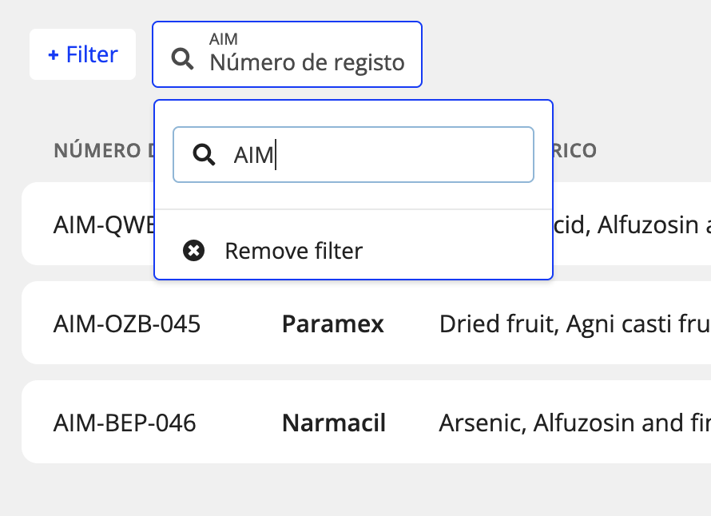

# Data View Filters

Data View Tables can be filtered, sorted and searched comprehensively in the front end. However, since the type and structure of the data being displayed could be anything, we sometimes need to give explicit definitions of exactly how filtering, searching and sorting should work -- although the defaults are often fine in simple cases.

<!-- toc -->
## Contents <!-- omit in toc -->
- [Search](#search)
  - [API](#api)
- [Sorting](#sorting)
  - [API](#api-1)
- [Filters](#filters)
  - [Handling complex data structures](#handling-complex-data-structures)
  - [Creating filter data with multiple values](#creating-filter-data-with-multiple-values)
  - [How is Filter data generated?](#how-is-filter-data-generated)
  - [Filter columns](#filter-columns)
  - [Filter types (and available options)](#filter-types-and-available-options)
- [Filter definitions](#filter-definitions)

*Please ensure you are familiar with how [Data View and Data View Column Definitions](Data-View.md) work in general before diving into filter definitions here*

## Search

The front-end can display a standard "Search" input field at the top of the table for quick search-based filtering of the table results. However, you need to configure exactly what is being searched.

This is done by specifying an array of searchable fields in the `table_search_columns` field of the `data_view` table.

E.g. in a "Users" table, the `table_search_columns` might be:  
`[ fullName, email ]`

Any text entered into the Search input will be matched to the values of these columns, using partial string matching (case insensitive):

- search text "arl" would match "Carl", "Arlo", "earl@myplace.com"

These searches *only* use text matching though, so the specified search columns should contain text data. If you need to narrow the results by more complex data structures, then you can specify [Filter definitions](#filters)

If no `table_search_columns` (i.e. `null`) are provided, the "Search" input will not appear in the front end.

### API

Search text is passed to the server as part of the query parameters of the `data-views/<table>` endpoint, e.g.

```
/data-views/product?search=arl
```

## Sorting

In the front-end, clicking on a column header will sort the table by that column (and clicking again reverses the order). If the column is a "basic" column (i.e. maps to an actual database column), then the default sort should be adequate, and no specific definition is required. However, if you have a column whose data is defined by a [value_expression](Data-View.md#data_view_column_definition-table) then you will need to define how it should be sorted. (If not, then the user will receive a "Column not sortable" notification when they try to sort by it.)

We do this by specifying *another* column in the field `sort_column` for `data_view_column_definition`, which is what the database will sort by when clicking on this column.

For example, if you have an "Address" column, that is build by combining a number of different fields (e.g. `address`, `province`, `country`), then you could specify any one of these as the value to sort by when clicking your custom "Address" column.

It's also possible to convert complex data types to simplified "text" (or other simple data) versions of the values (see [Handling complex data structures](#handling-complex-data-structures) for more info), in which case you can specify this simplified column as the sort column for the more complex display value.

### API

Sorting requests are passed to the server as part of the query parameters of the `data-views/<table>` endpoint, e.g.

```
/data-views/product?orderBy=name&ascending=false
```

## Filters

In the front end, there are several diffent UI elements for filtering table data. Which one is shown for a given data value is determined by a combination of the data type and explicit filter definitions specified in `data_view_column_definition`.

### Handling complex data structures

One of the main challenges with trying to create filters is that much of the data stored in tables is not easily filterable. Many fields store the entire "response" object that came from an application question, which could be any complex shape. For example, a `genericNames` field that has captured responses from a "Search" element might have data stored like so:

```
{
  "text": "Ascorbic acid, Agni casti fructus, Alfuzosin and finasteride",
  "selection": [
    {
      "name": "Ascorbic acid",
      "atcCode": "G01AD03",
      "category": "Gynecological antiinfectives and antiseptics"
    },
    {
      "name": "Agni casti fructus",
      "atcCode": "G02CX03",
      "category": "Other gynecologicals"
    },
    {
      "name": "Alfuzosin and finasteride",
      "atcCode": "G04CA51",
      "category": "Urologicals"
    }
  ]
}
```

Clearly this is not filterable in any meaningful way with simple database queries. So we've provided a mechanism by with complex data values can be converted into more easily parse-able objects, such as plain text or numbers.

We can define "filter data" columns, which are defined like so:

- an extra column definition in `data_view_column_definitions`. It's just the same as other definitions, but the `column_name` field should have the suffix `FilterData` to be recognised by the system as a filter data column.
- there are two fields in `data_view_column_definitions` that are of relevance:
  - `filter_expression`: an [evaluator](Query-Syntax.md) expression defining the value for the filter data column. It's essentially the same as the [`value_expression` column](Data-View.md#data_view_column_definition-table) in that it takes the current record as the evaluator "objects" parameter.
  - `filter_data_type`: this tells the script that creates the filter data columns what data type to use. Normally it will be text ("varchar") as that's by far the easiest to work with, which is the default, so you won't need to enter anything in this column most of the time. In theory, this could be any Postgres type, but the only other data types that have been proven to work reliably are "integer" and "boolean".
- an additional column is added to the data table in question, with this "FilterData" (or "filter_data" in postgres) suffix, with these computed values entered into it.

#### Filter data example

Say we have a "product" table with a "manufacturers_list" that stores a listBuilder response in it:

```
{
  "list": [
    {
      "LBname": {
        "value": {
          "text": "MedPack"
        },
        "isValid": true,
        "stageNumber": 1
      },
      "LBtasks": {
            ...
            },
            "textUnselected": "Fabricação de material Activo, Fabricação de diluente, Empacotamento e rotulagem, Segundo empacotamento, Testes química e física, Testes de esterilidade, Testes microbianos, Armazenamento, Esterilização, Liberação para fornecimento",
            "textMarkdownList": "- Fabricação de dosagem\n",
            "selectedValuesArray": [
                ...
            ],
            "textMarkdownPropertyList": "- Fabricação de material Activo: \n- Fabricação de dosagem: Fabricação de dosagem\n- Fabricação de diluente: \n- Empacotamento e rotulagem: \n- Segundo empacotamento: \n- Testes química e física: \n- Testes de esterilidade: \n- Testes microbianos: \n- Armazenamento: \n- Esterilização: \n- Liberação para fornecimento: \n",
            "textUnselectedMarkdownList": "- Fabricação de material Activo\n- Fabricação de diluente\n- Empacotamento e rotulagem\n- Segundo empacotamento\n- Testes química e física\n- Testes de esterilidade\n- Testes microbianos\n- Armazenamento\n- Esterilização\n- Liberação para fornecimento\n"
            },
            ...
        },
        "LBaddress": {...},
        "LBcountry": {...},
        }
      },
      {
      "LBname": {
        "value": {
          "text": "General Manufacturers"
        },
        ...
        }
      }
    ],
    "text": ...
    },
```

We could could create a column definition called `manufacturerListFilterData` and define its `filter_expression` like this:

```
{
  "operator": "+",
  "children": [
    "",
    {
      "operator": "objectProperties",
      "children": [
        "manufacturersList.list.LBname.value.text"
      ],
      "output": "string"
    }
  ]
}
```

Which would return this output based on the original response data: `MedPack, General Manufacturers`

That value is (automatically) stored in a field called "manufacturer_list_filter_data" on the "product" table, with that value in it for this record, which is much more suitable for filtering.

Note that it is entirely possible to create *multiple* filter data columns for a single original data column if there's several data elements in it that you wish to filter by. For example, for an ingredients list, you might want a "names" and a "types" filter data column from a single response object.

Tip: every response type has a "text" field, and often this value will be sufficient to create a filterable data source.

Remember that, like `value_expression`, evaluator expressions can perform database lookups, so you can do thing like making certain columns filterable based on data elsewhere in the database (e.g. a table of users might display the organisations they belong to -- this can be filtered using a suitable `filter_expression`).

### Creating filter data with multiple values

You will have noticed the above example created a comma-delimited string of values. This is the preferred way to represent multi-value data in filter definitions, as it's much easier to create database queries to partially match seperate substrings than it is to search inside arrays. As to how the filters parse these strings, please see the ["delimiter" property below](#link???).

### How is Filter data generated?

There is a script, `generateFilterDataFields.ts` that can create and update all filter data columns. The script scans the system for existing filter data columns and updates them or creates new ones based on what's in the `data_view_column_definitions` table. It can also (optionally) regenerate ALL values for existing filter_data fields.

Currently, the only time the app automatically runs it is as an option on the [modifyRecord](List-of-Action-plugins.md#modify-record) action, which ensures that new records automatically have filter data generated for them.

However, there is an endpoint that can be called as required to regenerate all filter data throughout the system. You would normally want to run this after updating or adding filter data column definitions to ensure all data is up-to-date.

The API is:

```
/admin/generate-filter-data-fields?<query>

```

Query parameters:

- `table`: the name of the database table to update filter_data for. If not provided, it will update *all* filter data in the system
- `fullUpdate` (`true`/`false`): if `true`, the script will re-compute (i.e. will re-evaluate every record) the filter_data for all existing filter data as well as generating values for missing data. If `false`, it will only update records where all filter data columns are `null` (i.e. these should be *new* records). By default, `fullUpdate` is `false` when a `table` is specified (this is what `modifyRecord` uses), but `true` when no table is specified (i.e. all tables).


### Filter columns

The columns that will appear as available filters for a given data view are defined in `filter_include_columns` and `filter_exclude_columns`. These work the same way as the table view and detail view [include/exclude lists](Data-View.md#data_view-table), but with the following differences:

- if nothing is specified (i.e. `null` value), the defaults will be the same as the table view columns that are being returned. This is because, by default, we expect the available filters to be for the same data as the table columns.
- Similarly, the special value `...` matches all *table* columns, not the full set of columns. So it becomes fairly straightfoward to specify a filter set that closely matches the table columns but with, for example, one extra column and one exclusion. It's a good idea to explicitly exclude columns for which the data can't be processed by one of the standard filters -- however, using mapped "filter data" columns (see [above](#handling-complex-data-structures)) it's possible to get meaningful, filter-able content from almost any type of data.
- If a "filter data" column is defined, the "filter data" version of the column will be returned as a filter definition instead of the original data source. For example, if there exists a `genericNames` column with a complex listBuilder response as its value, and also a `genericNamesFilterData` (they only differ by suffix), the `genericNamesFilterData` column will be returned in filter definitions.

Note, then, that is possible to create filters for columns that don't necessarily appear in the table itself (useful when your table is getting cluttered but you still need lots of filtering options).

### Filter types (and available options)

All remaining filter configurations are done via the `filter_parameters` column, which takes a JSON object of optional parameters, similar to the [`additional_formatting` column](Data-View.md#data_view_column_definition-table).

Not all filter types require all parameters, so we'll go through each type of filter and describe the relevant parameters for each.

The Filters available for Data Views are derived from (and in some cases the same as) the Application List filters, but have been made more generic as the incoming data is not known by the front-end.

#### Options list


This is the filter that shows by default when the incoming data type is a `string`. When you instantiate the filter, the filter component makes a request to the server for a list of possible options. The list is itself "filtered" by typing in the input field. There is a maximum of 10 items returned in this filter list, so the user will need to narrow the list by using the search box.

The list of options can be configured with the following `filter_parameters` (they are all optional):

- `searchFields`: an array of column names specifying what to filter by. By default each filter just searches the column for which it's been generated (i.e. itself), so you'll rarely need to specify this. But, like the "Address" example [above](#sorting), you might wish to specify a few different database fields to search by (i.e. `address`, `province`, `country`) (You could have also generated a "filter_data" column that combines all three values into a single text field but, since all these values are text, this wouldn't be needed -- just specify the `searchFields` instead.) *The `searchFields` parameter is the only parameter which is common to *all* filters described here.*
- `delimiter`: this one is important for handling multiple values in a single field, as alluded to [earlier](#creating-filter-data-with-multiple-values). In the example shown in the image here, the filter options are actually derived from text fields structured like this:
   ```
   "Ascorbic acid, Agni casti fructus, Alfuzosin and finasteride",
   "Arsenic, Paracetamol",
   "Ascorbic acid, Miracle Whip",
   ...
   ```
  In order to seperate them into a more useful list of individual options, we can specify a `delimiter`, which in this case is a comma: `","`. Just a reminder that it preferable to configure multiple options like this as delimited strings rather than arrays (as partial matching array elements in GraphQL is not really feasible in our current setup).
- `includeNull`: (boolean, default `false`). Sometimes data view columns may contain `null` values. These *will* show up in the filter list (they appear as (Blank)), but only if `null` happens to appear in the top 10 options results (due to 10-item maximum). And typing anything in the Search field will obviously immediately exclude `null`, so it's possible to never see the `null` option in the options list. But if the `includeNull` parameter is set to `true`, then the options list returned from the server will *always* include the `null` "(Blank)" value.
- `showFilterList`: (boolean, default `true`) as mentioned above, this Options list filter is the default filter for any `string` data. However, if you wish to provide a free-text search instead (often more useful when every item has a different value), set `showFilterList` to `false` and a ["Text search" filter](#text-search) will be displayed instead.

##### API

The options list filter makes its own request to the server to get the list of available options:
```
/data-views/<dataViewCode>/filterList/<column>

```

The search text (and other options) are provided in the body JSON of the request. (See Postman collection in front-end repo for examples)

#### Text search



A free text search, used for `string` data if `showFilterList` is set to `false` (above). Works the same as the general [Search](#search) field, but configured for a particular data source.

There are no other parameters available, other than the (optional) common `searchFields` parameter.


#### Number range


Displayed when the incoming data is a `number` type, and allows the user to specify a range to filter by.

In the example shown here, the "Shelf life" filter is filtering a column that actually has "text" values ("9 Meses", etc). In this case, we have used a "filter data" column to generate a numeric variant of the shelf life column in order to allow filtering.


#### Boolean option


Displayed when the incoming data is a `boolean` value. The relevant parameter here is:

- `valueMap` (or `booleanMapping`): a JSON object that specifies what values to display in the filter for the `true` and `false` values. In this example, the `valueMap` parameter would be:

    ```
    {
        "true": "Ativo",
        "false": "Inativo"
    }
    ```


#### Date


Displayed when the incoming data is any of the `Date` types, and allows the user to specify a date range to filter by.

## Filter definitions

Filter definitions are returned by the server as part of the [Data View Table request](Data-View.md#data-viewsdataviewcodequeries), and contain all the information needed by the front end to present a set of filters as described above. Here is an example of a returned `filterDefinitions` (and `searchFields`) field (part of the full [Data View Table response](Data-View.md#data-viewsdataviewcodequeries)):

```js
...,
"searchFields": ["name", "registration" ] // as described in "Search" section above
"filterDefinitions": [
    {
        "column": "registration",
        "title": "Número de registo",
        "dataType": "string",
        "showFilterList": false,
        "searchFields": [
            "registration"
        ]
    },
    {
        "column": "name",
        "title": "Medicamento",
        "dataType": "string",
        "showFilterList": true,
        "searchFields": [
            "name"
        ]
    },
    {
        "column": "companyName",
        "title": "Entidade",
        "dataType": "string",
        "showFilterList": true,
        "searchFields": [
            "companyName"
        ]
    },
    {
        "column": "origin",
        "title": "Origem OR Medicamento",
        "dataType": "string",
        "showFilterList": true,
        "searchFields": [
            "origin",
            "name"
        ]
    },
    {
        "column": "registrationDate",
        "title": "Data do registo",
        "dataType": "Date",
        "showFilterList": false,
        "searchFields": [
            "registrationDate"
        ]
    },
    {
        "column": "genericNamesTextFilterData",
        "title": "Nome genérico",
        "dataType": "string",
        "showFilterList": true,
        "searchFields": [
            "genericNamesTextFilterData"
        ],
        "delimiter": ","
    },
    {
        "column": "medicineType",
        "title": "Medicine Type",
        "dataType": "string",
        "showFilterList": true,
        "searchFields": [
            "medicineType"
        ]
    },
    {
        "column": "dosageForm",
        "title": "Dosagem",
        "dataType": "string",
        "showFilterList": true,
        "searchFields": [
            "dosageForm"
        ]
    },
    {
        "column": "administrationRoute",
        "title": "Via de admninistração",
        "dataType": "string",
        "showFilterList": true,
        "searchFields": [
            "administrationRoute"
        ]
    }
...
```