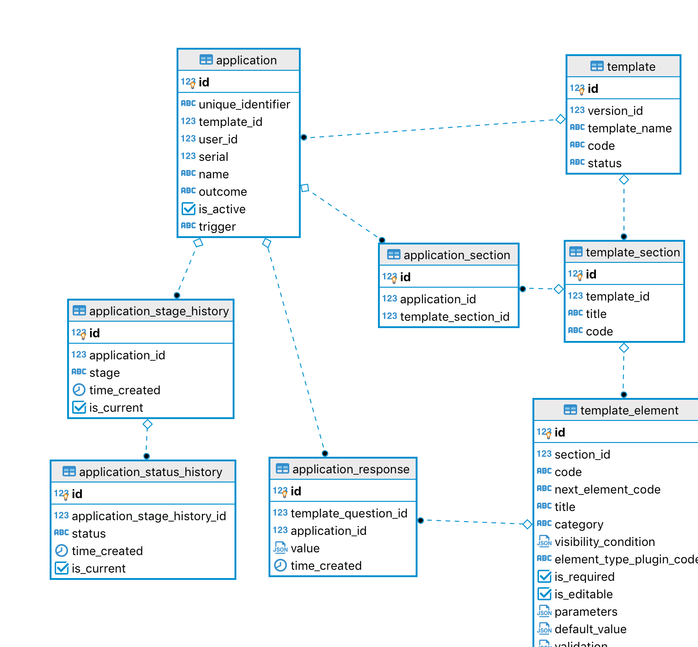

# Database Schema Application

# Database Area description: Application

## Application instance

The application has all the visualisation and logic defined in the **application template** [(described in Database Schema Template)](Database-Schema-Template.md). When the Applicant clicks to apply for an application type (aka template) a new instance of one application is created for them. The Applicant user can make changes until submitting the application to be reviewed.

### application

Representation of the application instance. All nested elements are accessible via joined tables and can be created or queried in the same call using the GraphQL engine.

The `template_id` links to the template used to display all sections and elements (questions) to the user.

The `user_id` links to the Applicant user that created this application.

The `serial` is a number used to display the application number to users.

The `name` will be deduced by the template name + user + company names.

The `is_active` is set to `'true'` for all applications that are still in the review process or are in Draft status.

The `is_active` is set to `'false'` for applications that have finished the review process, have expired or were withdrawn by the Applicant.

The `trigger` is updated everytime the application has changes done by users or a scheduler. See more about [triggers](Triggers-and-Actions.md)

The `outcome` is either `'Pending'`, `'Approved'`, `'Rejected'`. The application is 'Pending' during the review process, each stage will store also the outcome, so it will only be updated to here once the review process is finished resulting in either 'Approved' or 'Rejected'.

**To be considered:**

- The `unique_identifier` is a new field. What is it used for? Should is replace the `serial`?

### application_section

Sections of the application. It will point to the `template_section` that stores all the elements (questions) to be displayed. This table is required as it provides a way to associate reviews (which are per-section) to specific application sections.

The `application_id` links to the application.

The `template_section_id` links to the template.

### application_stage_history

There is one or more stages per application template. Each one is defined by `template_stage`. The application stage history will keep records for when the application changed to each particular stage (previously defined for this application template).

The `application_id` links to the application.

The `stage_id` links to the template stage, which will have the `name` and number of this stage.

The `time_created` records when this stage was created.

The `is_current` is set to `'true'` while this is the current stage of this application. Otherwise is set to `'false'`.

**To be considered: When the application review is not in progress anymore do we keep the last `is_active` stage as `'true'`?**

### application_status_history

For each stage of the application it can have associated statuses. The application status history will keep records for when the
application changed to each particular status of a stage.

The `application_stage_history_id` links to the application stage (and the application itself).

The `status` is either `'Draft'`, `'Withdrawn'`, `'Submitted'`, `'Changes Required'`, `'Re-submitted'`, `'Completed'`.

The `time_created` defined when this status of a stage was created.

The `is_current` is set to `'true'` while this is the current status of this application stage. Otherwise is set to `'false'`.

## Question response

For every new answer that the Applicant give to each requested elements (questions) in the application a new **application response** is created. The Applicant user can make changes to responses until submitting or re-submitting the application to be reviewed.

### application_reponse

The `template_element_id` links to the template element, which defines what is the question/information and how to render in the application.

The `application_id` links to the application.

The `value` is what the Applicant user enter as a response.

The `time_created` defined when this response was created.

More detailed description of response coming soon: `value`.
