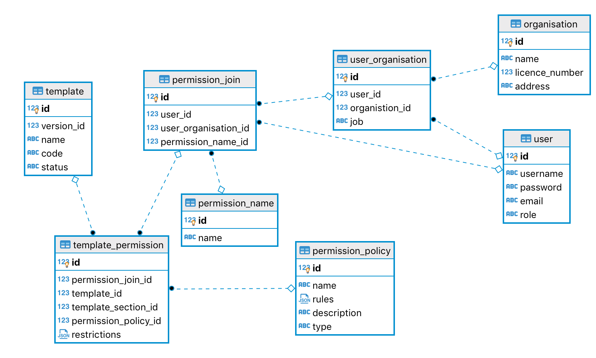

# Database Schema Permission

## Database Area description: Permission

### Definition

To define permissions with actionables for the user over an application templates.

We like to define the permissions definition using: Who, how and what.

**Who** => Is the `permission_name`, which describes the type of action to be associated with users.

**How** => Is the `permission_policy` or how the user that has this permission can interact with an application template (through actions).

**What** => Is the `template_permission` that connects some permission with an application template or section of an application template.

Before any user is included, permissions can be created. The permission definition consists only of the `permission_policy` and the `permission_name`. And then what links this permission with an application template is the `template_permission`, and after the permission is granted to a user (or a user in a company) what links this permission with an user is the `permission_join`.

Access to the database is restricted using PostGres row-level security policies, which are defined by these permission settings.

## Tables

### permission policy

The `name` and `description` of the policy helps the Admin users identify the policy details.

The `type` is the action type, that should be one of the options: `'Apply'`, `'Review'`, `'Assign'`, ...(few more to be added).

The `rules` will define the list of when the user is allowed to be acting on the linked application. For example, the policy to Apply for an application is that the associated User ID is the same as your and the current status set as Draft or Changes required.

The `default_restrictions` is similar to `restrictions` (on the **template permission**). Basically from the whole set of possibilities that the `rules` allow the user to make via actions on an application, the restrictions will limit when these actions can be done.

### permission name

The `policy_id` links to the permission policy.

The `name` should be a short very descriptive name of a generic permission (not based on an individual application template).

### permission join

The `permission_name` links to the permission name.

The `user_id` links to a user with this permission granted. (Can be NULL, if is a user_organisation permission).

The `user_organisation_id` links to a user from a company with this permission granted (Can be NULL, if is a user permission).
