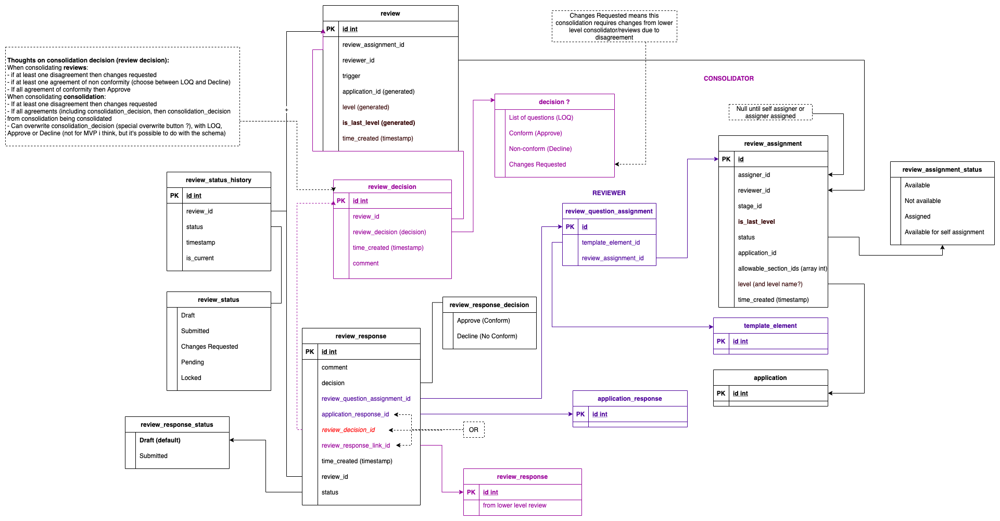
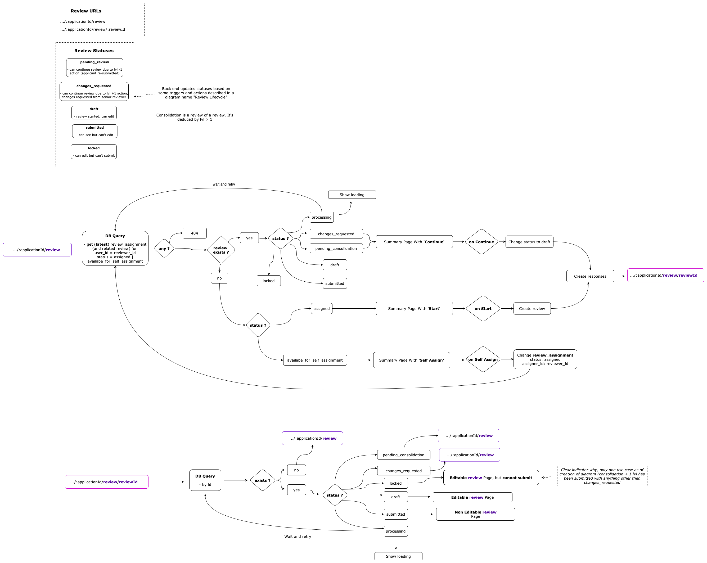

# Database Schema Review

Original thinking was for review and consolidation to be separate entities, upon looking at intersection in schemas, it was apparent that they should be combined. Consolidation is really the review of a review vs review of application.

## Review Levels

Each stage of application is broken down into review levels, base level (1) is the review of application, level > 1 are reviews of reviews (consolidations). Level 1 reviewer reviews application (including re-reviews as a result of applicant replying to LOQ changes), and deals with changes requested from consolidator. Likewise consolidators review reviews and make suggested decision

## Review Decision

The decision options have different outcomes depending on the level of review... The options to move to another stage or send a response to Applicant **most time** when:

- Review is level > 1 (and `is_last_level` set in `review_assignment`) which is refered as a Consolidation. Or
- Only one level in review (i.e. screening)

All available options are:
`Conform (Approve)` -> All of the applicant's responses must be marked as **Approved** by reviewer. Or on consolidation when consolidator has agreed with all reviewers' decisions. This is the only option available.

`Send back to applicant` (aka LOQ) -> At least one of applicant's responses is marked as **Rejected** by reviewer, and the consolidator agreed with reviewers decisions. In this case in the consolidation a reviewer has the option to select between *Send back to applicant* or *Non-Conformity* only.

`Non-conform (Decline)` -> At least one of applicant's responses is marked as **Rejected** by reviewer, and consolidator agreed with reviewers decisions. In this case in the consolidation a reviewer has the option to select between *Send back to applicant* or *Non-Conformity* only.

`Changes Requested` -> Applies to consolidation only. When at least one response has been disagreed with lower level reviewer. This is the only option available.

PS: When the stage has `is_final_decision` set in `review_assignment` both options are always available: `Conform (Approve)` or `Non-conform (Decline)`.

## Review Assignment

These records are created by back end when review level is reached (either through application submission or review submission, see Review Life Cycle diagram below). `template_permission`, `permission_name`, `permission_name_join` and `permission_policy` are checked in order to created relevant `review_assignments`
They can be queried to:
- Determine who can be assigned to an application stage and level
- Determine if current user assignment has available_sections to be assigned (considering other assignments aren't visible to him)
- Determine if review can be started <- front end can check if review can be created See `Review and Consolidation URL flow` diagram below

#### Review Assignment

##### Status

`Available` -> can be assigned by assigner

`Assigned` -> review is assigned to the user who can start their review

Some rules apply for Assignment:
- `is_self_assignable` means that the user can assign himself (after checking `available_sections`)
- `is_final_decision` is always Self-assignable
- Consolidation and one level in review also consider all sections should be assigned to same reviewer
##### Other fields (that are not straight away self explanatory)

`assigner_id` -> null until assigned, assigner id when assigned be assigner, otherwise reviewer_id when self assigned

`is_last_level` -> last level for current stage (determine if review_decision is present in UI)

`is_last_stage` -> check if reviewer is on the last stage to review this application

`allowed_sections` -> An array of section Codes that reviewer has permission to review (would typically be NULL which means - all sections allowed), assigner can only assign questions from sections that are in this list (or NULL).

`assigned_sections` -> Used when status is `Assigned`. Will list which sections have been assigned

`available_sections` -> Used when status is `Available`. Determine which sections aren't assigned to someone else and can be assigned (considering `allowed_sections`)

## Review Response

See diagram (responses flow). Always created by front end, but duplicates are trimmed on back end.

Each review_responses is associated to one review and can be either for a:

- **Review** of applications questions (base review, level 1), or
- **Consolidation** of reviews (consolidation review, level > 1).

- `review_id` - reference to the review, which doesn't change when the review is updated (just new `review_responses` and `review_status_history` that are created)

- `application_response_id` - reference to which application response this review applies to
- `review_response_link_id` - reference to which review this review applies to (only for review > 1)
- `original_review_response_id` - reference to original review (level 1 or self-reference to `id` in case this is the same review level 1). This can change, if the reviewer level 1 update their review_response. So it's always the latest one done by reviewer level 1.
- `is_visible_to_applicant` - set only for `original_review_response` that are selected in the LOQ (currently any with a DECLINED decision - and if there is consolidation with an AGREE decision linked to the review_response level 1).

### Duplicates and timestamps

When does a `review_response`gets duplicated?

- If the review needs updates (`PENDING`status) or changes (`CHANGES_REQUESTED` status). When the review starts - by user - the front-end creates a mutation with all assigned review_responses duplicated.
- On consolidation ? - **TODO**: not sure

The reason we need 3 fields for dates is because we used to store everything in the `time_update`, but with the duplicatiion system we also need to update the timeStamp of all oldest `review_responses` to match the latest `review_status_history`. Keeping the `time_updated` for when the review_response was actually changed.

So now we use 3 different ones to keep this clearer. The use for each is described bellow:

- `time_created` - when the review was created (on click `start`, `make changes` or `update` by user)
- `time_updated` - when the response was updated by the user - used to display on the History panel
- `time_submitted` - when the review was submitted (even though not changed by user in this update) all latest `review_responses` need to be aligned with `review_status_history` to be used in a few places for duplication of responses and assignment.

### Review response decision

- `comment` - something that the reviewer wanted to comment about this particular response
- `decision` - Approval or rejection of a particular response. Can be used to agree or disagree on overall review_decision.
  The decision is referencing one of the `review_reponse_decision` values: `APPROVE`, `DECLINE`, `AGREE` or `DISAGREE`. But what iis displayed for each decision is based on localisation settings on front-end.

## Review Question Assignment

Identifies which questions, from the application can be reviewed by the reviewer.
These records are created upon assignment, and should only be created for level 1 reviewer ? (to confirm)

## Review Assignment Assigner Join

A collection of users who have permission to assign other users (reviewers) to applications. These records are generated upon submission of any application or review: after review assignments are generated, each new review assignment is joined with the users who have "Assign" permissions for those applications. (This happens as part of the **generateReviewAssignments** Action)

### A few trick bits:

#### Review Responses Are Always Duplicated

During re-review, or in reply to changes requested, all existing review responses are duplicated (so that any changes are recorded in a new record). They are trimmed by an action on back end.

#### Review Submitted When Consolidation is in Progress

Similar to the above, but we don't duplicate `draft` review responses

#### Review Response Decision

Pretty self explanatory but one thing to note, during consolidation, it's best to think of these as `Agree and Disagree`

## Review Statuses

`Draft` -> Newly created or being edited as part of re-review or changes required from consolidator, can be edited

`Submitted` -> Cannot be edited, submitted for consolidation (at this stage, can either be with consolidators or higher up authority withing NRA or with an applicant as LOQ)

`Changes Required` -> This status is used to indicate to reviewer that changes are requested from consolidator. It would go to `Draft` when review is started (to make the required changes)

`Pending` -> Indicates that lower level changes have been made which require re-start of review. For level 1 it indicates that Applicant has replied to LOQ and it needs to be re-review. For level > 1 indicates that a review/consolidation from lower level has been submitted. (in case multiple 'parallel' reviews are being done, for every review submission, consolidation status will change to 'PENDING', thus allowing indication of additional reviews needing consolidation)

## General Description

Review flow is as follows (see review flow diagrams below):

- On application submission or on review submission, `review assignments` are created with an action
- Questions are assigned to reviewer or self assignment (using `review assignments`)
- `review` is created on front end
- `review_response` is created for each assigned question (`application_response`), or for each review_response if consolidation
- Decision is made (suggested) of either conformity or non-conformity along with a comment (for consolidation these are agree or disagree)
- Multiple `review_response` can be made for the same `application_responses` or `review_response` (consolidation), and timestamps determines the current `review_response` (this allows for consolidator to ask for changes from reviewer or reviewer to see what needs to be re-reviewed based on applicant re-submission triggered by LOQ)

### Submission Rules

Review can be submitted

- When at least 1 of the **latest** `application_response` for `template_elements` that are assigned to a reviewer in current stage of an application instance is `declined`

OR

- When all of the **latest** `application_responses` for `template_elements` that are assigned to a reviewer in current stage of an application instance are `approved`

AND

- In case of changes requested by cosolidator in review, no `review_responses` have linking `consolidation_response` with disagreements (i.e. a new `review_response` exists, that's different from review response it was duplicated from, see below)

### Creating and editing review

Whenever user starts a review (either first time or subsequent times that they can edit it after submissions), we would create all responses, or duplicate them from existing responses. Trimming is done for unchanged responses after submission via an action (above rules should take into account duplicates). Slight difference for consolidation is we only duplicate review_response that are not 'DRAFT' and for reviews that are submitted

### Diagram

Below diagrams are somewhat outdated, but give an idea of consolidation and review process as examples

