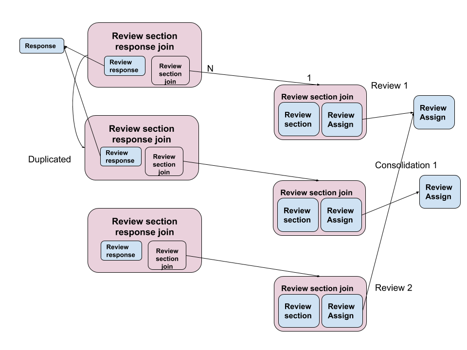

# Database Schema Review

## Database Area description: Review

### Review

The **review** is part of the application process where an application is approved or rejected in the system. For example, a Drug Registration application, after being submitted, goes through stages. In each one of these stages at least one review is required. Users with special permissions to make reviews on applications are called **Reviewers** (or evaluators).

The Reviewer may or may not have permission to submit the **LOQ** (List of Questions) back to the Applicant, who will then be able to edit their responses for these questions for re-submission.

### Consolidation

In the (**application template**) a set of (**template permission**) define how many reviews are required per **stage**. Reviewer users that have the correct `review level` will be able to submit the LOQ and comments back to the applicant.

A **consolidation** (which is stored the same way as a review) is when a second review is required for a **stage** in the **appliation template**.

The first review is done by Reviewers with lower `review level` permission, where they can add comments and decisions to individual responses. This review will sit there until another review, called **consolidation**, is done (on top of the previous ones), which will be sent back to the Applicant as a List of Questions (LOQ). In some cases even one more review can be done on top of the second one - more details about that coming soon.

## Tables

### review

A single review is created per **application stage**. However, some applications may not require any review (which will be defined by the actions for the particular template and stage on the trigger `onApplicationSubmitted`).

The `application_id` links to the application being reviewed.

The `status` of the review is either: `'Awaiting review'`, `'In Progress'`, `'Ready'`, `'Approvable'`, `'Non-Approvable'`. This is the status of the whole review. It is automatically defined by the combination of `review_section.decision` - the review of each section. See [SQL functions](Functions.md) for more details.

The `comment` is some overall comment for the application - added by the Reviewer making the consolidation. It will be sent to the Applicant with the review.

The `time_created` is the time when the review has started which is when the first section is assigned to a reviewer.

The `trigger` is updated everytime the review has changes done by users. See more about [triggers](Triggers-and-Actions.md).

**To be considered:**

- The `review` is per pair of **application-stage** or one per each time it goes back to the Applicant? I think it would be always one per each pair, although the field `review.comment` implies one overall comment which should be sent to the Applicant - per review. In the case if the review is re-submitted and another review will be started (on the same stage), how we would we keep this comment? Or do we remove it or do we create another `review`?
- The `status` of `'Ready'` - which is when a lower level reviewer has finished the review and the consolidation can happen - is defined in the Schema latest documentation of Drive as `'Reviewed'`. Is it what we have agreed on? I can update it, just want to check that first.

### review section assignment

Represents the assignment of one application's section, on one stage, to a Reviewer. A single recors to store the assignement and idependent of the **review_section** (which stores as many reviews are done by the same reviewer in the same section of the same stage).

The `reviewer_id` links to the user assigned to review a section of the application.

The `assigner_id` links to the user assigner of the Reviewer.

The `stage_id` links to the review's stage of the application.

The `section_id` links to the review's section of the application.

The `level` is defined by the permission of the reviewer associated with this review. Added to here to facilitate finding out which reviews have been done.

**To be considered:**

- The name `review_section_assginment` is quite long and doesn't add much. Since the entity already stores the `section_id` should we just rename it to `review_assignement`?

- The `stage_id` should be replaced to be in the `review` table instead? When a new stage start it seems that a new review will start and then all its `review_section_assignement` will be in that same **stage**.

### review section join

This join table connects the **review**, the **review_section_assigment** and 1-N **review_section**. This is used for either a simple review or a consolidation, which should be marked with the `send_to_application` flag to define the LOQ.

The `review_id` links to the main review record of the **application stage**.

The `review_section_assignment_id` links to the reviewer of the section.

The `review_section_id` links to the section being reviewed.

The `send_to_applicant` is a flag for adding this section (and `review_section.comment`) to be sent back to the Applicant.

**To be considered:**

- The field `section` linking to the `Application_section` in both `review_section_assignment` and `review_section_join`. One has to go.

### review section

Represents each review done in a cycle - more than one review may be needed considering the review done after a Re-submittion. In the case this is created for a consolidation it will start as a copy of the existing review that can be edited by the user before submiting the review.

The `decision` is either: `'Approved'`, `'Rejected'`, `'Observations'` and what is the overall decision per section. It is automatically defined by the combinatiion of `review_response.decision`. See [SQL functions](Functions.md) for more details.

The `comment` is also an overall comment of the whole section being reviewed. It can be sent to the Applicant with the review.

### review response

Represent the review of a single response. In the case this is created for a consolidation it will start as a copy of the existing review that can be edited by the user before submiting the review.

The `application_response_id` links to the answer given by the Applicant.

The `decision` is either: `'Approved'`, `'Rejected'`, `'Observations'`. The decisions is given by the Reviewer for this particular response of the Applicant.

The `comment` is used when the decision is set as `'Obervations'`. A free text field where the Reviewer explains the problem found. If this review response is added to the LOQ, this comment is sent to the Applicant with the review.

The `trigger` is updated everytime the review response has changes done by users. See more about [triggers](Triggers-and-Actions.md).

### review section response join

This join table connects the **review_response** and the joint of the **review_section** (that has other important connections). It represents the group of reviewed questions done by a reviewer on a section. This is used for either a simple review or a consolidation, which should be marked with the `send_to_application` flag to define the LOQ.

The `review_section_join_id` links to the review's section and Reviewer.

The `review_response_id` links to the reviewed response record.

The `send_to_applicant` is a flag to add the associated `review_response` in the LOQ selected to be send to the Applicant.

**To be considered:**

- The name `review_section_response_join` is quite long and doesn't add much. Since the entity `review_section_join` already stores the `section_id` should we just rename it to `review_response_join`?

