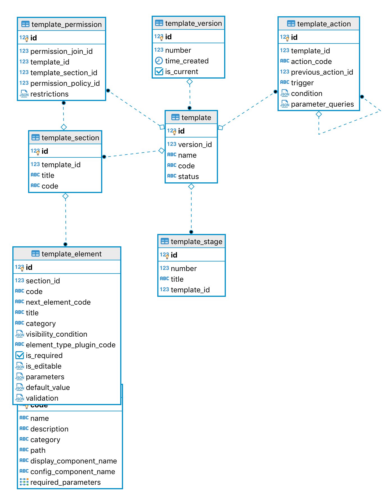

# Database Schema Template

# Database Area description: Template

## Display elements

The sections and questions required in each stage of an application is defined in the application template with the following entities.

### template

Representation of the application template. All nested elements are accessible via joined tables and can be created or queried in the same call using the GraphQL engine.

Whenever a template is modified, the new version is saved as a new template record with a new `version_timestamp`. Different versions of the same base template are connected with the same `code`. The `status` field is used to indicate which version is the current active one.

The `name` is what users of the system will see as the "Application Type" -- e.g. "Drug Registration".

The `status` can be `'Draft'`, `'Available'` or `'Disabled'`. The version currently active in the system is the one (and only one) marked `'Available'`.

**To be considered: Should we check if no applications are associated with an existing template and just add changes to the current version instead?**

### template stage

There is one or more stages per application template. Each one is defined as a new record that point to `template_id` with the `number` of this stage (1, 2, 3, ...) and title can be anything, but typically would be: `'Screening'`, `'Assessment'`, `'Final Stage'`.

### template sections

Sections of the application template that contain some [elements/questions](Elements-Questions.md). Each section can be associated with a **template permission** if this section requires a certain type of reviewer to check for responses from an Applicant.

### template elements

Elements in the application template always are part of a section, therefore it stores the `section_id` instead of the `template_id`.

The `code` is unique for each element in the same **template**. This code will be auto-generated, but we would allow the Admin user to change if needed.

The `next_element_code` links to the unique code of the next element to display in the application. So we order elements as a linked list.

The `title` is what the Admin user can use for some more detailed definition of this element. Displayed only in the [Template Builder](Template-Builder.md).

The `category` is either `'Question'` or `'Information'`. The 'Questions' are elements that will require responses from the Applicant and 'Information' elements are only structural or for visualisation.

The `visibility_condition` checks for a condition that will be evaluated and run using the [**Query syntax**](Query-Syntax.md). Examples of visibility conditions:

- checkes for any required previous elements to be answered before this element can be displayed
- check for current `stage` (e.g. only showing request for payment documentation during `'Assessment'`)
- or anything that can be expressed in a JSON query expression.

The `element_type_plugin_code` is associated with the **element type plugin**, where the definitions of each element will be coming from.

The `is_required` determines which 'Question' elements that are compulsory (when visible, defined by the **visibility_condition**).

The `is_editable` determines which 'Question' elements should be editable in which conditions. e.g. A questions that should be editable depending on the selected option of a previous Question; A question that is only editable when the **application stage** changes.

More detailed description of question elements coming soon: `parameters`, `default_value` and `validation`.

### element type plugin

Also known as the **Question plugin**, each record in this table refers to an external [Plugin bundle](Question-Plugin-Bundles.md) in the plugins folder (`src/plugins`).

The `display_component_name` references the UI component the applicant sees when filling in the form.

The `config_component_name` refers to the UI component used to create the question/element in the [Template Builder](Template-Builder.md).

## Permission settings

Different users needs different permissions for acting on an application template.

For example an **Applicant user** would be required to be associated with a template permission in order to **Apply** to a specific application of a template type. Another example is a **Reviewer user** who would be required to be associated with a template permission in order to **Review** applications of a specific template type (or specific sections of the application of a template type) on a certain stage.

### template permission

The template permission is the link between users and templates. Each one can be for the entire application template with `template_id` and no `template_section_id` or have it the section defined for more specific permissions related to a section.

The `permission_policy_id` link to the actual permission policy to describe what are the policies associated to this template permission.

The `permission_join_id` links this permission to a user/company and `restrictions` would add more specific rules.

More detailed description of template permissions coming soon: `restrictions`.

## Triggered actions

The workflow of what should happen after an expected trigger in each stage of one application is defined in the application template by actions. Triggers are every change on the application, flagged by the field `trigger` which has associated actions. See more about [triggers](Triggers-and-Actions.md)

The actions logic are defined inside action plugins, which execute a function to generate some change in the database. (Link to Action plugins comming soon)

### action plugin

The `code` is unique per action plugin.

The `name` and `description` are for visualisation to help Admin users selecting what action to use for an application template.

The `path` is the local path in the server where the imported plugin is stored.

The `function_name` the name of the function to be called when the action runs.

The `required_parameters` is the name of the fields required of local object or queries to be used when the action runs.

### template action

The `template_id` links the action with the application template.

The `trigger` describes what is the trigger associated with this action. The list of possible triggers can be found [here](Triggers-and-Actions.md)

The `action_code` of the associated **action plugin**, where the definitions for the action are coming from.

The `condition` is a JSON expression that must evaluate to true for the Action to proceed.

The `parameter_queries` is an object mapping each of these fields from `action_plugin.required_parameters` to a JSON expression to provide the value to these fields.
