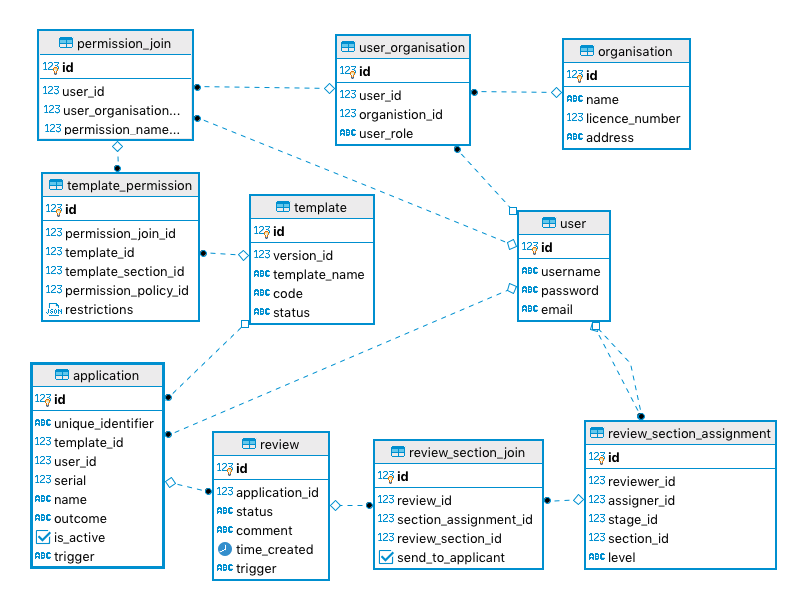

# Database Schema User

# Database Area description: User

## User instance

An user is either the Applicant that wants to apply to a application (Registration) in the system or the other entities (i.e. Reviewer) that will be the evaluator of the workflow of the application. What will define exact the type of user are permissions (permission_join) which is associated with the user and the organisation of the user. So the same user may have different actions available depening on the company selected on the login.

### user

The `username` is what the user will use to login to the system and the name that show on the User area.

The `password` is the secret used by the user to login - which should be stored using some encryption to be defined.

The `email` might be also used to login the user to the system. The email is confirmed before the account is activated.

**To be considered:**

- A few more fields will be required in the user table, to be added as needed.

### organisation

The `name` is how the company/organisation is defined in the system.

The `license_number` is a number generated by the system and stored in the organisation. It shoudl also have a expiry.

The `address` is the phisical address where the company can be found in the country.

**To be considered:**

- A few more fields will be required in the user table, to be added as needed.
- The `license_number` could be stored in a different table that have the `organisation_id`, the license number, expiry and if it's valid. This way when a company license is renewed we can create a new entry and link to the company, keeping track of old licenses.

### user organisation

The `user_id` links to the user table.

The `organisation_id` links to the organistion.

The `user_role` is just a literal for now that states what is this user role in the organisation. It is created based on what permissions the user has to act as the organisation. For example a user that creates the company in the system can be the **company owner** and another user that joins the compnay by default can be the **employee**. Other example is the user that is part of FDA and when associated with the main organisation in the system the default job is **revisor**.
