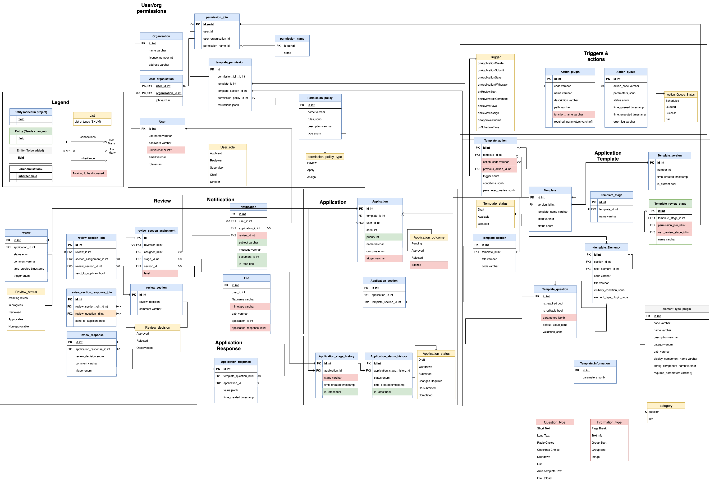

# Database Schema

The database is constructed in [**PostgreSQL v12**](https://www.postgresql.org/) and accessed from the front end using [**GraphQL**](https://graphql.org/learn/), via [**PostGraphile** ](https://www.graphile.org/postgraphile/) -- a layer which presents a Postgres database as a GraphQL schema.

Here is the overall schema (work in progress):

## Detailed areas

- [Permissions](Database-Schema-Permission.md)
- [Application Template](Database-Schema-Template.md)
- [Application](Database-Schema-Application.md)
- [Reviews](Database-Schema-Review-And-Consolidation.md)
