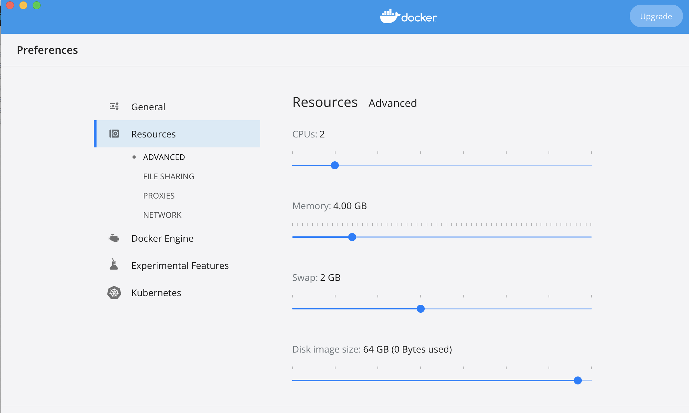

# Docker

**minimum version** of docker 18.09 is required

In Docker folder you will find scripts to build an overall image of both front and back end. Typically individual images are built and composed via docker compose. The reason behind single image was to list all of the steps needed to build and deploy app on a fresh ubuntu instance

## Container internals overview

- `nginx` serves web app at `/`, server on `/server/` and GraphQL on `/postgraphile`
- when container is started, bash session is launched, allowing terminal access to container

## Dockerfile

- Installs all of the dependencies
- Pulls both repos (with specified branches)
  - Since we are using github packages, authentication is required, which is done via a `secret`, see `./dockerise.sh` below
- Copies configurations
  - `nginx_config/application_manager.conf`, to set up reverse proxies and serve `server` and `postgraphile` on routes
  - `postgres_config/pg_hba`, to enable no password authentication to pg, careful if port is exposed form container
  - `web_app_config/config.json`, to point web app to `server` and `graphql` correctly
- Builds both repos
- Initialised database (schema and data), `./database.sh`
- Sets up entrypoint (which would launch postgres, postgraphile and server, on container startup, and launches `bash` session), `./entry.sh`

Logs for postgraphile and server are displayed in terminal and also written to `/var/log/application_manager`

## ./dockerise.sh

See comments in the scripts for some more details.

This script can be used to build image, it launches `docker build` with predefine parameters.

`githubtoken.txt` is required in the root directory, it should contain github token: https://github.com/settings/tokens -> generate new token -> [x] read:packages

Build args can be specified via `--build-arg` command:

- `SERVER_BRANCH` and `WEB_APP_BRANCH` -> branches or tags to pull and build. Can escape `#` with `\#`
- `NODE_VERSION` node version (just the major)
- `POSTGRES_VERSION` postgres version (just the major)

If image was built for specific branch, but branch content was changed, need to use `--no-cache`

`-t` is used to specify the build image tag, see `Tagging` below

**NOTE**: If you are using `Docker Desktop` on mac, you would need to increase the size of memory and swap for front end to build correctly, my settings:

## ./run.sh

See comments in the scripts for some more details.

This script can be used to launch an image, it launches `docker run` with predefine parameters.

`-ti` is used to interact with the container (without this command container will exit straight away), for deployment container would need to be detached. `-ti` allows us to interact with the container via terminal

`-v` container files and folders can be mounted to local file system, see `Volumes` below

`-p` port mapping, atm should be running on `3000`, since it's hard coded via `wep_app_config/config.json`

Last parameter to `docker run`, is the image name and tag

## Tagging

We want to set up a convention for tagging images, ideally images that will be pushed to docker hub would be built from combinations of tagged releases of back/front repos. And the resulting image would be tagged: `'TMF-application-manager:B-{back end tag}-F-{front end tag}'`

## Volumes

Can edit `./run.sh` to expose files and folders within the contianer, see `./run.sh` for more details.

Add `-v {local-path}:{container-path}

Common container paths

- nginx config: `nginx_config:/etc/nginx/conf.d/`
- nginx log: `/var/log/nginx/`
- postgresql data: `/etc/postgresql/12/main/`
- postgresql log: `/var/log/postgresql/`
- back end snapshots: `/usr/src/application_manager_server/database/snapshots/`
- back end and postgraphile log: `/var/log/application_manager`

**NOTE** -> when starting new container it will first try to use content of local volume, so it's best to either empty those folders for new image (if you've mounted them)

## Pushing to dockerhub

TODO
