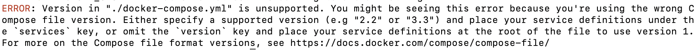

# _Conforma_ New server setup on Ubuntu 10.04

Steps to create new server:

- Have new server running on Openstack
- Open ports 50000 and 50001 for public
- Add the BW entry "<Country> Conforma Server" and with the public address to be used for Conforma app 
  - to be edited by the end of this setup (here only for reference)
- After provided with public key, access via terminal using ssh
- Install Docker engine as instructed here: https://www.digitalocean.com/community/tutorials/how-to-install-and-use-docker-on-ubuntu-20-04
- Log in to docker hub (terminal `docker login`) as msupplyfoundation user
- Pull the last image from docker-hub:
  Example: `sudo docker pull msupplyfoundation/conforma-demo:build-v0.2.0-3_2022-04-06_pg-12_node-14`
- Set all required ENV VARIABLES:
  Example:
  - `export TAG='build-v0.2.0-3_2022-04-06_pg-12_node-14'`
  - `export WEB_URL='<host-domain>:50000'`
  - `export JWT_SECRET='<make-your-own>'`
  - `export SMTP_SECRET='<secret-in-BW>'`
- Install Docker compose:
  `sudo apt install docker-compose`
- Upgrade Docker compose to v2 as instructed here: https://docs.docker.com/compose/cli-command/#install-on-linux
- Copy demo-server folder to new server with `scp`
- Configure the domain: for host on cpanel with BW "conforma.nz cpanel"
- Install SSL Certificate with certbot (Let's encrypt)
- Install nginx and copy config from demo-server/
- Make sure nginx is running with:
  `systemctl status nginx`
- Manually changed nginx config file to forward external ports to internal: todo - add file example to demo-server folder...
- Open ports 50000 and 50001 externally on new server
- Started App & Dashboard on local ports 8000 and 8001:
  - You will need to be inside the folder `demo-server`
  - Run `PORT_APP=8000 PORT_DASH=8001 sudo -E docker compose --project-name 'conforma-on-8000' up -d`
**Note** that uses `docker compose` instead of `docker-compose` to use the correct package installed on the server. Otherwise (when using docker-compose) you'll get this error:
    
