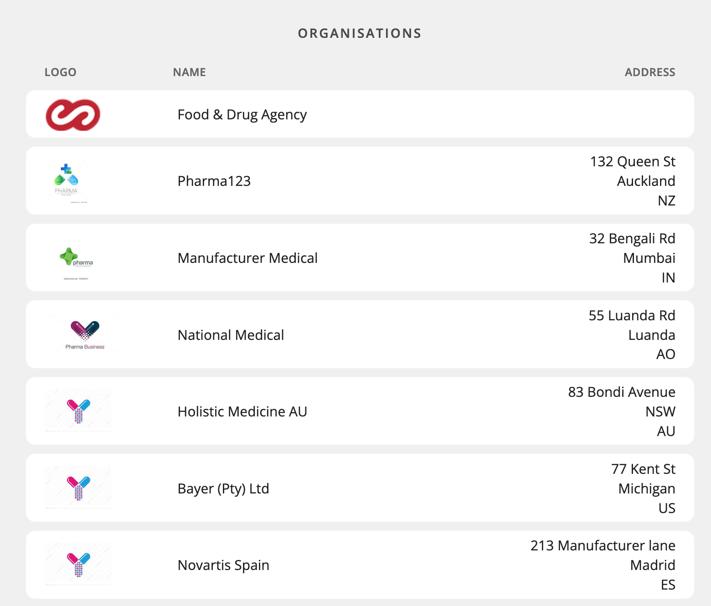
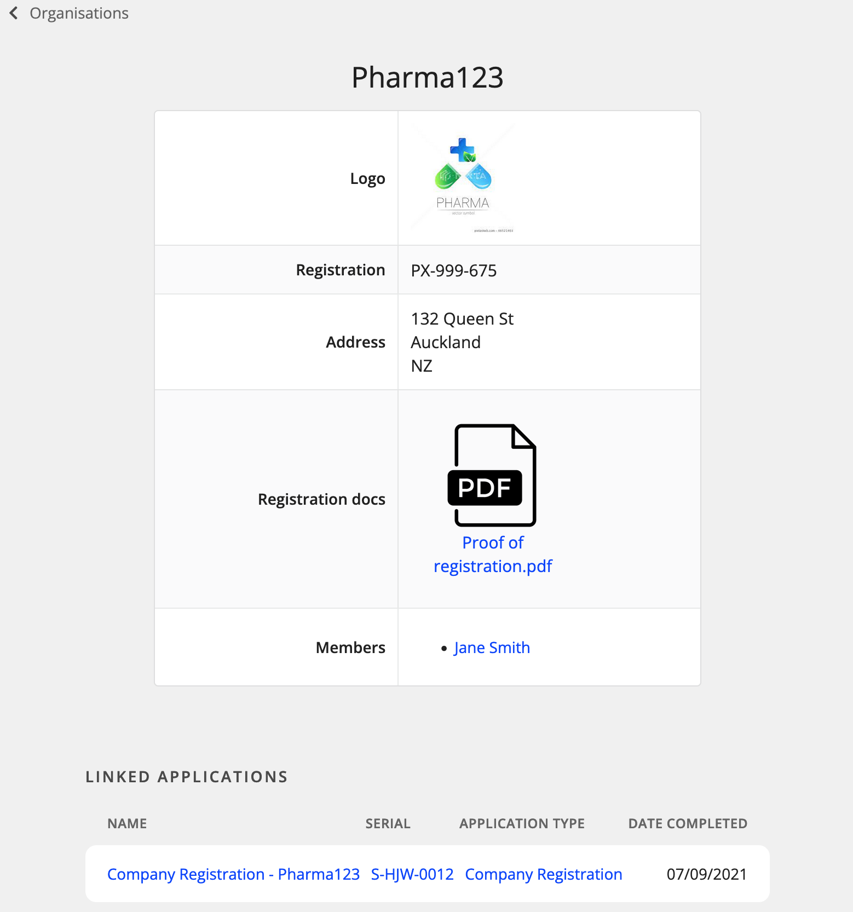

# Outcomes Display

<!-- toc -->

## Contents
  - [API](#api)
    - [`/outcomes`](#outcomes)
    - [`/outcomes/table/<tableName>?<queries>`](#outcomestabletablenamequeries)
      - [Query parameters](#query-parameters)
    - [`/outcomes/table/<tableName>/item/<id>`](#outcomestabletablenameitemid)
  - [Configuration](#configuration)
    - [`outcomes_display` table](#outcomes_display-table)
    - [`outcome_display_column_definition` table](#outcome_display_column_definition-table)
    - [Additional formatting](#additional-formatting)
    - [A note about Array data](#a-note-about-array-data)
  - [Real use-case example](#real-use-case-example)

Display of **Outcome** tables (e.g. Products, Users, Orgs) (or any table, strictly speaking) can be configured for viewing in the UI by setting entries in the `outcome_display` and `outcome_display_column_definition` database tables. This allows us to set:

- who is allowed to see them
- what columns to show different types of user
- "special" columns, which show the result of an [evaluator](Query-Syntax.md) expression, so can show some fields combined, or queries to another table, for example
- how columns should be formatted in the UI

The data is served to the front-end via the `/outcomes` API end-points, and serves data based on the request's JWT header, so we can ensure that no user can receive data that they haven't been configured to be allowed to see.

The database's row-level permissions ensure that only allowed rows are returned to the user, and the logic in the "outcomes" code returns allowed columns. (NB: We will also be adding some row-level logic to the outcomes API for additional configuration -- see [this issue](https://github.com/openmsupply/application-manager-server/issues/590))

## API

Outcomes data is available at the following endpoints:

### `/outcomes`

Returns an array of outcome tables the user is allowed to see (based on JWT header), formatted as follows:

```
[
    {
        "tableName": "user",
        "title": "Users (Restricted View)",
        "code": "userRestricted"
    },
    ...etc.
]
```

This endpoint is called in order to populate the Outcomes menu in the UI.

### `/outcomes/table/<tableName>?<queries>`

For querying a specific table. Data is returned in the following structure:

```
{
    "tableName": "user",
    "title": "Users (Restricted View)",
    "code": "userRestricted",
    "headerRow": [
        {
            "columnName": "firstName",
            "title": "First Name",
            "isBasicField": true,
            "dataType": "string",
            "formatting": {}
        },
        {
            "columnName": "lastName",
            "title": "Last Name",
            "isBasicField": true,
            "dataType": "string",
            "formatting": {}
        },
        ...etc.
    ],
    "tableRows": [
        {
            "id": 9,
            "rowValues": [
                "Jane",
                "Smith",
                "jane_smith",
                "jj@nowhere.com"
            ],
            "item": {
                "firstName": "Jane",
                "lastName": "Smith",
                "username": "jane_smith",
                "email": "jj@nowhere.com""
            }
        },
        ...etc.
    ],
    "totalCount": 13
}
```

Note that each table row is returned as both an array of values *and* a single "item" object with key-value pairs.

`totalCount` is used for pagination purposes (since only one page of data is returned at a time)

#### Query parameters

Query parameters are (currently) as follows:

- `first` -- number of records to return (default: 20)
- `offset` -- start from record number (default: 0) (used in conjunction with `first` to control pagination)
- `order-by` -- field to sort by (default: `id`),
- `ascending` -- whether to sort ascending or descending (default: `true`)

Eventually, there will be additional parameters for searching and filtering -- not yet implemented

### `/outcomes/table/<tableName>/item/<id>`

Fetches data about a single item, for display in Outcome "Details" view. Data is returned in the following format:

```
{
    "tableName": "user",
    "tableTitle": "Users (Restricted View)",
    "id": 9,
    "header": {
        "value": "Jane Smith",
        "columnName": "fullName",
        "isBasicField": false,
        "formatting": {}
    },
    "columns": [
        "username",
        "email",
        "dateOfBirth",
        "orgs"
    ],
    "displayDefinitions": {
        "username": {
            "title": "Username",
            "isBasicField": true,
            "dataType": "string",
            "formatting": {
                "substitution": "_${}_"
            }
        },
        "email": {
            "title": "Email",
            "isBasicField": true,
            "dataType": "string",
            "formatting": {}
        },
        "dateOfBirth": {
            "title": "Date Of Birth",
            "isBasicField": true,
            "dataType": "Date",
            "formatting": {}
        },
        "orgs": {
            "title": "Member of",
            "isBasicField": false,
            "formatting": {
                "substitution": "[${organisation.name}](/outcomes/organisation/${organisation.id})"
            }
        }
    },
    "item": {
        "username": "jane_smith",
        "email": "jessica@msupply.foundation",
        "dateOfBirth": null,
        "orgs": [
            {
                "organisation": {
                    "name": "Pharma123",
                    "id": 2
                }
            },
            {
                "organisation": {
                    "name": "Manufacturer Medical",
                    "id": 3
                }
            },
            ...etc.
        ]
    },
    "linkedApplications": [
        {
            "id": 25,
            "name": "User Registration - UR-ZLQ-0102",
            "serial": "UR-ZLQ-0102",
            "templateName": "User Registration",
            "templateCode": "UserRegistration",
            "dateCompleted": "2021-09-07T07:08:42.590371+12:00"
        }
    ]
}
```

Note the different types of data returned and the formatting instructions. Also, the "orgs" field has a complex value and is not just a simple field from the "user" table (hence `isBasicField: false`). More on this below.

## Configuration

### `outcomes_display` table

In order to make outcome data available to the front-end, the minimal configuration requirements are a single entry in the `outcome_display` table with the following fields provided:

- `table_name` -- name of the table we are displaying
- `code` a unique (per table) identifier

And with that, the "table_name" table will show up in the Outcomes menu, and it will show all fields to everyone in both Table and Details view.

However, we normally want to not show every field, and not to every user, so further specifications would normally be required.

Different configurations of fields and who can see them can be set up for each table, so for convenience, we are calling a single configuation a "layout"

The following fields are also configurable in "outcomes_display" layouts:

- `title`: the name of the "outcome" that shows in the "Outcomes" menu and as the Header of the table (e.g. "Users"). Default is just the tableName converted to plural Title Case, e.g. `user` => "Users"
- `permissionNames`: an array of permissions names that the request requires (via JWT) in order to see this Layout. Default is an empty array, and both that and `null` allow full access (i.e. no restrictions)
- `table_view_include_columns`: an array of fields to return for the "table" endpoint. Should be field names written in camelCase. All values should match with either the name of a field in the table being queried, or the name of a "custom" column defined in `outcome_display_column_definition` (see below).  
Some things to be aware of:
  - `null` or empty array means return ALL fields
  - if you've named a "custom" field in here and yet still want to return all other fields, you can specify this by including the special value "..." as an item, which has the same effect as the "...rest" parameter in javascript.
- `table_view_exclude_columns`: an array of columns to exclude. Basically, it takes all the columns collected from the "include" list, and removes any named here.
- `detail_view_include_columns` / `detail_view_exclude_columns`: exactly the same as the "table_view" fields, except applies to the fields that show up in the Details view
- `detail_view_header_column`: name of the field/column whose value should be used as the Header display in Details view. If not specified, the table name will just be used.
- `show_linked_applications`: if `true`, the `/item` endpoint will also return an array of linked applications connected to this particular item. These are taken from the outcome "join" tables, whose records are created on successful application approvals.
- `priority`: when multiple layouts match the request (i.e. user has permissions for more than one Layout), the returned columns will be a union of the columns specified in both layouts. However,there will still only be one "Title" and "Header column" returned and each layout may have a different one, so the layout with the highest priority will be used. In general you'd want to give the more "restrcited" permission the higher priority, but most of the time you won't need to consider this as the Title and Header would often be the same. Default value: `1`.

Okay, so if you're just wanting to display fields directly taken from the outcome table in question, and the formatting requirements are all "simple" types (text, number, boolean, Date) the `outcomes_display` table is all you need. However, if you want to return columns with more complex data (such as a list of ingredients, or a query to another table) or require non-default formatting, you'll need to define these in the `outcome_display_column_definition` table.

### `outcome_display_column_definition` table

As mentioned, this table is for defining how to return columns with specifications beyond that which can be defined in the `outcomes_display` table.

The input fields are as follows:

- `table_name` (as above)
- `column_name`: must match with one of the column names specified in the inclusion lists above.
- `title`: title to show for the field name. If not specified, it will just be the column_name in "Start Case".
- `element_type_plugin_code`: if the value being returned is a whole application response, then it will be parsed and displayed using a front-end element plugin (SummaryView). This is where you specify the code of the plugin required. If `null`, value won't be sent to a SummaryView element for display.
- `element_parameters`: if a plugin is specified above, then it will require input parameters. This value should be an object containing all the parameters required for display. Values of parameters can be literals or evaluator queries, and will be evaluated by the front-end in SummaryView just like a normal form element.
- `additional_formatting`: a custom object specifiying additional formatting definitons. Detailed explanation below.
- `value_expression`: if `null`, the returned value will just be the value of the field from the table in question. However, if you are defining a custom column, or you want to over-ride the value of the field, this field should contain an evaluator expression. The "object" passed into the evaluator for "objectProperties" operator is the current record (item) represented as key-value pairs. So, for example, if you wanted to return a custom field from the "user" table that combined both first and last names (column name: `fullName`), your `value_expression` query would be:  
```
{
  "operator": "stringSubstitution",
  "children": [
    "%1 %2",
    {
      "operator": "objectProperties",
      "children": ["firstName"]
    },
    {
      "operator": "objectProperties",
      "children": [ "lastName"]
    }
  ]
}
```  
`firstName` and `lastName` are native fields on the "user" table, and are at the root level of the passed-in object here. Note that this object contains *all* fields, not just the ones being returned, so you can extract values from fields not being returned, such as in this case (where you wouldn't want to return `firstName` and `lastName` fields as well as a `fullName` column.)

### Additional formatting

The additional formatting field is intended to be an extensible field, where we can add new "custom formatting" definitions as required. Currently, the following properties are supported:

- `dateFormat`: Out of the box, if the returned value is a Date type, then it will be displayed in a nice "short date" format (DD/MM/YY) (locale-dependent). However, if you want a different date format, the value here should either be one of the Luxon date/time presets (see [here](https://moment.github.io/luxon/#/formatting?id=presets)) or a whole Luxon date format object.
- `substitution`: A string value with `${<property>}` substitution parameters, the same technique used by the "listBuilder" and "search" plugins for displaying complex input data. If the value returned by the column this applies to is an object, then `<property>` refers to a property of that object.  
For example, if the returned value was `{name: "John", age: 35}` and you wanted to display it with the name in bold and the age after it in brackets, the substitution string value would be:  
  `**${name}** (${age})`
All fields are interpreted as Markdown by the front end, so this would display as: **John** (35).  
Named properties on an object can be deeply nested, e.g. `user.firstName`

  If the returned value is *not* an object, we can substitute the whole value into the substitution string using `${}` (i.e. empty parameter) e.g. to display any simple column's value in italics, we'd just add the substitution string `*${}*`

  Note: the same result could be achieved using a complex evaluator query in the `value_expression` field, but this is just a simpler (and hopefully more readable) way to do basic substitutions.

### A note about Array data

If a column value is an array, then the array will be interpreted as a Markdown list, and all formatting options (plugin type, additional formatting, etc) will be applied to *each item* in the list. See below for an example.

## Real use-case example

Here is an `outcome_display` entry for showing Organisations:

```
{
    "id": 3,
    "tableName": "organisation",
    "code": "organisation",
    "title": "Organisations",
    "permissionNames": null,
    "tableViewIncludeColumns": [
        "logoUrl",
        "name",
        "address"
        ],
    "tableViewExcludeColumns": null,
    "detailViewIncludeColumns": [
        "logoUrl",
        "...",
        "members"
        ],
    "detailViewExcludeColumns": [
        "id",
        "name",
        "isSystemOrg"
        ],
    "detailViewHeaderColumn": "name",
    "showLinkedApplications": true,
    "priority": 1
}
```

This layout describe how to display the `organisation` table. It will have the title "Organisations" (when in Table view).

- `permissionNames` is `null`, so all users will see this layout
- Table view will show the three named columns
- Details view, however, is a little more complex
  - `...` shows all columns. The reason why we include it *after* `logoUrl` is because we want the logo to appear first in the Detail table.
  - the column name `members` is not a field on the `organisation` table. This means we will expect it to have a custom definition in the `outcome_display_column_definition` table.
  - we exclude `id`, `name` and `isSystemOrg`, so the complete list of fields that will be shown in Details view is (in order):
    - logoUrl
    - registration
    - address
    - registration_documentation
    - members (custom column)
- In Details view, the page Header will be the value from the `name` field (which is why it made sense to exclude it from the list of fields to show)
- We also are allowed to see a list of Linked Applications in Details view

We now define three columns with custom definitons in `outcome_display_column_definition`: `logoUrl`, `registrationDocumentation` and `members`. That means that the other two will just use their field name as column title, and the values in those fields will be shown as plain text.

Let's look at the custom column definitions one by one:

**logoUrl**

```
{
    "id": 6,
    "tableName": "organisation",
    "columnName": "logoUrl",
    "title": "Logo",
    "elementTypePluginCode": "imageDisplay",
    "elementParameters": {
    "url": {
        "children": [
        {
            "children": [
            "applicationData.config.serverREST"
            ],
            "operator": "objectProperties"
        },
        {
            "children": [
            "responses.thisResponse"
            ],
            "operator": "objectProperties"
        }
        ],
        "operator": "+"
    },
    "size": "tiny",
    "altText": "No logo supplied"
    },
    "additionalFormatting": null,
    "valueExpression": {}
}
```
- It will displayed using the "imageDisplay" plugin
- The `elementParameters` define the url for the logo, namely: a combination of the server host and the value from the current response (the response object being the "value" returned in the `logoUrl` field, which is just a text path to the file).
- No "additionalFormatting" -- it's all handled by the "imageDisplay" plugin
- No "valueExpression" -- we just want the data straight from the `logoUrl` field

**registrationDocumentation**

```
{
    "id": 8,
    "tableName": "organisation",
    "columnName": "registrationDocumentation",
    "title": "Registration docs",
    "elementTypePluginCode": "fileUpload",
    "elementParameters": {},
    "additionalFormatting": null,
    "valueExpression": null
}
```
Pretty straightforward, it just uses the "fileUpload" plugin to display, and the value in this field is the whole response object required for the file display.

**members**

```
{
    "id": 10,
    "tableName": "organisation",
    "columnName": "members",
    "title": "Members",
    "elementTypePluginCode": null,
    "elementParameters": null,
    "additionalFormatting": {
        "substitution": "[${user.firstName} ${user.lastName}](/outcomes/user/${user.id})"
        },
    "valueExpression": {
        "operator": "graphQL",
        "children": [
            "query getOrgUsers($id:Int!) { userOrganisations(filter: 
                {organisationId: {equalTo: $id}}) { nodes { user 
                { id, firstName, lastName }}}}",
            "graphQLEndpoint",
            ["id"],
            {
                "operator": "objectProperties"
                "children": ["id"],
            },
            "userOrganisations"
            ] 
        }
}
```
This is the most sophisticated display field -- it shows a clickable list of users who belong to this organisation. The key definitions here are:
- `valueExpression` defines a GraphQL query to fetch users via their "userOrganisation" link
- `additionalFormatting` -- It's not clear here, but the above query returns an *array* of users, which (as mentioned above) will be formatted as a Markdown list by the front-end, so all our formatting definitions apply to each item (i.e. "user") in the array. So this `substitution` string is showing the full name of the user, formatted as a (Markdown) hyperlink, which links to a url showing the Detail view of this user.

All up, these definitions will be interpreted by the front-end and displayed in a Table view that looks like this:



And a Details view like this:

