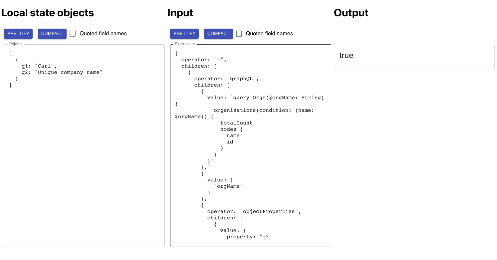

# (Dynamic) Query/Expression Syntax

This module is in `src/modules/expression-evaluator`, structured as its own package for standalone development.

The current build of the module is published to Github packages so it can be easily imported into both front- and back-end projects. See [Installation](#installation) at the end of this page for instructions on how to make it work in your environment, or [Development](#development) for information on further development of the module, including a browser-based GUI expression builder.

Run `yarn test` to see it in action.

---

**The problem**: the highly configurable Template system in mSupply Application Manager requires many values to be stored as dynamic queries to either local state or the database, and perform basic operations (logic, concatenation, etc.) on them. We need a way to represent these potentially complex “expressions” in the database so they can be evaluated at runtime (both in the front and back-end), but without resorting to using `eval()` to evaluate javascript code directly.

**The solution**: We store these queries in a JSON **expression tree** which can be easily traversed recursively and evaluated when needed. This way, we can store very simple values (e.g. literal strings) in the same format as complex dynamic queries. The function `evaluateExpression()` evaluates these expressions.

Any value that could possibly be a dynamic query should be stored in this format. This would include:

**Question**:

- Parameters (Option lists, Labels, Placeholder text, etc.)
- Visibility conditions
- Validation criteria

**Trigger**:

- Conditions

For more complex lookups, we would hide the complexity from the user in the Template builder, and just present a set of pre-defined “queries” in the UI, which map to a pre-written query with perhaps a selectable parameter or two. (However, we should also provide a JSON editor as an alternative if an advanced user wishes to manually create more complex queries.)

# Structure

Each node in the tree is an object with the following properties:

```
{
  value: <optional>
  type: <optional>
  operator: <optional>
  children: [ <optional> ]
}
```

At a minimum, a single `value` must be provided:

```
{ value: "Enter your first name" }
```

If a dynamic result is required, an `operator` is provided instead of a `value`, which is a pre-defined function that returns a value. If an `operator` is used, then also required is a `children` array, which contains child nodes, each with the same structure, which return the parameters for the `operator` to act on. For example:

```
{
  operator: "+"
  children: [ {value: 5}, {value: 3} ]
}
```

This expression would return the number **8** when evaluated.

Note that any child node can, in turn, be an operator node with its own children, allowing for expressions of arbitrary complexity. (See examples below)

## type

The `type` property is optional in most cases, but some operators will return their results in a different format depending on the `type` (e.g. pgSQL -- see below).

Valid values:

- string
- number
- boolean
- array
- object (maybe? -- not required yet)

# Operators

## AND

Implements logical AND on the returned values of its child nodes.

- Input: 1 or more nodes that return a **boolean** value
- Output: **boolean**

## OR

Implements logical OR on the returned values of its child nodes.

- Input: 1 or more nodes that return a **boolean** value
- Output: **boolean**

## CONCAT

Concatenates the values of the child nodes, which can be either strings or arrays.

- Input: 1 or more **string** or **array** nodes
- Output: Either **string** or **array**, depending on the `type` specified (defaults to “**string**” if unspecified)

## = (Equals)

Equality test for child nodes

- Input: 1 or more nodes of either **string** or **number** type.
- Output: **boolean**

_Note: uses javascript "loose" equality, so `2 == "2"` and `null == undefined`._

## != (Not equal)

Inequality test for child nodes

- Input: Exactly 2 nodes of either **string** or **number** type.
- Output: **boolean**

## + (Plus)

Adds any number of number nodes together

- Input: 1 or more nodes of **number** type.
- Output: **number**

## ? (Conditional)

Returns a different value depending on whether an expression is `true` or `false`.

- Input:

  - 1st child node returns `true` or `false`
  - 2nd node returns value if `true`
  - 3rd node returns value if `false`

- Output: the result of either child 1 or child 2

Functionally equivalent to javascript ternary (`?`) operator

## REGEX

Compares an input string with a regular expression string and returns whether it matches.

- Input: Exactly 2 nodes of **string** type. First must contain string to be evaluated, second contains the regex.
- Output: **boolean**

## objectProperties

For extracting values from local state objects (e.g. `user`, `organisation` or `form`) as part of dynamic queries, e.g to determine a question's visibility condition based on an answer to a previous question.

The `evaluateExpression` function expects each expression to be passed along with _all_ objects that are required for evaluation in any descendant nodes. See **Usage** below for detailed overview of arguments.

- Input:

  - 1st child node returns the name of the field whose value is to be extracted. Can be a nested property, written in dot notation (e.g. `questions.q2`) (but cannot yet get specific elements from arrays.)
  - 2nd (optional) node returns a Fallback value, to be returned if the property specified in the first node can't be resolved. Default is string "Can't resolve object", but could be useful to set to `null` in some cases.

- Output: the value specified in `property` of any type.

**Example**:

```
evaluateExpression(
    {
      operator: 'objectProperties',
      children: [ { value: 'application.questions.q1' } ]
    },
    { objects: { application } } )
```

where `application` is the local state object:

```
application = {
  id: 1,
  name: 'Drug Registration',
  status: 'Draft',
  stage: 1,
  questions: { q1: 'What is the answer?', q2: 'Enter your name' },
}
```

## stringSubstitution

Replaces placeholder parameters (`%1`, `%2`, etc) in strings with values supplied during evaluation.

- Input:

  - 1st child node returns a **string** containing a parameterized query (e.g.`"Hello %1, welcome to our application!"` )
  - 2nd...N nodes provide the replacement **strings** for the parameters in the first string.

  **Example**:

```
  {
    operator: "stringSubstitution",
    children: [
      "Dear %1, congratulations on your approval for registration of your product: %2",
      "John",
      "Paracetamol"
    ]
  }
```

Obviously the substitutions are likely to be dynamically generated values from `objectProperties` or `API`/`Database` queries.

## pgSQL

Performs queries to a connected PostGres database and returns the result in a format specified by `type`.

- Input:
  - 1st child node returns a **string** containing the parameterized SQL query (i.e. `$1`, `$2` substitution)
  - 2nd...N nodes return the values (**strings**, **numbers**, **arrays**) required for the above query substitution.
- Output: Depending on the `type` field:
  - `type: 'array'`: returns all values flattened into one array
  - `type: 'string'`: returns all results concatenated with spaces
  - `type: 'number'`: returns a single number
  - no `type` specified: returns the default `node-postgres` format (an array of objects, with fields of each object being the database column names)

**Example**:

```
{ type: 'string',
  operator: 'pgSQL',
  children: [
    'SELECT name FROM application WHERE template_id = $1',
    2,
  ]
}
```

## graphQL

Performs queries on connected GraphQL interface.

- Input:
  - 1st child node returns a **string** representing the GraphQL query
  - 2nd child node returns a **string** containing the url of the GrapqhQL endpoint. Using the value "graphQLEndpoint" (or empty string `""`) will the use the graphQL endpoint specified in the input parameter "GraphQLConnection" object.
  - 3nd child node returns an **array** of field names for the query's associated variables object. If no variables are required for the query, pass an empty array (i.e. `{ value: [] }`).
  - 4rd...N-1 child nodes return the values of the fields for the variables object -- one node for each field in the previous node's array.
  - The Nth (last) child node returns a **string** stating the node in the returned GraphQL object that is required. E.g. `applications.name` Because GraphQL returns results as nested objects, to get an output in a "simple type", a node in the return object tree is needed. (See examples below and in `TestData`). This last node is optional -- if not provided, the whole result object will be returned unmodified.
- Output: the returned GraphQL node can be either `string`, `number`, `boolean`, `array`, or `object`. If the output is an object, it will be returned as follows:

  - If there is only one field, only the value of the field will be returned.
  - If there is more than one field, the whole object will be returned.
  - Objects contained within arrays are also returned with the above logic.

**Example**:

```
{ operator: 'graphQL',
  children: [
    `query App($appId:Int!) {
        application(id: $appId) {
          name
        }
    }`,
    "graphQLEndpoint",
    ['appId'],
    1,
    'application.name',
  ] }
```

**Note**: To use the GraphQL straight away from what is in the graphil (json like), use it wrapper by \` and \`, otherwise it needs to be all in the same line.

## API

Performs GET requests to public API endpoints.

- Input: _(note: basically the same as GraphQL)_
  - 1st child node returns a **string** containing the url of the API endpoint
  - 2nd child node returns an **array** of field names for the url query parameters. If no query parameters are required, pass an empty array (i.e. `{ value: [] }`).
  - 3rd...N-1 child notes return the values for the query parameters in the 2nd node -- one node for each field name
  - Nth (last) child node returns a **string** stating the field/property of the return JSON object that is required. This is optional -- if not supplied the complete response data is returned (which is what you'd want if expecting something other than JSON object).
- Output: returned value can be any type. If is is an object, will be simplified according to the same rules as the **GraphQL** operator (above)  
  Note: if an array of objects is returned, the selected field (specified in the last input node) will apply to each object in the array.

**Example**:

This expression queries our `check-unique` to test if the username "druglord" is availabe. The full url would be:  
`http://localhost:8080/check-unique?type=username&value=druglord`

```
{
  operator: 'API',
  children: [
    'http://localhost:8080/check-unique',
    ['type', 'value'],
    'username'
    'druglord',
  ],
}
```

# Usage

The query evaluator is implemented in the `evaluateExpression` function:

`evaluateExpression(expression: Object, parameters: Object)`

### `expression`

`expression` must contain at least one node with a `value` property, or an operator with associated child nodes, otherwise the function returns `undefined`.

### `parameters`

`parameters` is an (optional) object with the following (optional) properties available:

- `objects : {local objects}` -- **object** containing nested local state objects required for the query (see **objectProperties** above)
- `pgConnection: <postGresConnect object>` (or any valid PostGres connection object, e.g. `Client` from `node-postgres`)
- `graphQLConnection: { fetch: <fetch object>, endpoint: <URL of GraphQL endpoint>}` -- connection information for a local GraphQL endpoint. Only required if expression contains **graphQL** operator.
- `APIfetch: <fetch object>` -- required if the API operator is being used. (Note: the reason this must be passed in rather than having the module use `fetch` directly is so it can work in both front- and back-end. The browser provides a native `fetch` method, but this isn't available in Node, which requires the `node-fetch` package. So in order to work in both, the module expects the appropriate variant of the fetch object to be passed in.)

# Examples

There is a **jest** test suite contained with this module’s repo which demonstrates a range of test cases. Here are a few:

### Simple (non-dynamic) examples

**Example 0**: A literal string Label of “First Name”:

```
{
   type: "string", // This is optional
   value: "First Name"
}
```

**Example 00**: Visibility condition for a question that should always be visible:

```
{ value: true }
```

**Example 000:** Array of options for a Dropdown list:

```
{
   type: "array",
   value: ["Pharmaceutical", "Natural Product", "Other"]
}
```

### Dynamic examples

**Example 1**: Concatenation of user’s first and last names

\_Note: <code>user</code> object is passed to <code>evaluateExpression</code> function in the 2nd parameter, \
i.e<code> {user: "user"}</code></em>

Tree structure:


```
{
 type: "string",
 operator: "CONCAT",
 children: [
   {
     operator: "objectProperties",
     children: [{ value: { object: "user", property: "firstName" } }],
   },
   { value: " " },
   {
     operator: "objectProperties",
     children: [{ value: { object: "user", property: "lastName" } }],
   },
 ],
}
```

**Example 2**: Visibility condition: Answer to Q1 (whose `code` is "q1") is "Drug Registration" and user belongs to at least one organisation.

_Note: this query uses PostGres (pgSQL) operator -- in the app, we’ll probably use GraphQL for front-end queries (visibility condition, form elements) and pgSQL for server-side queries (Action conditions)_

Tree structure:


```
{
 operator: "AND",
 children: [
   {
     operator: "=",
     children: [
       {
         operator: "objectProperties",
         children: [
           {
             value: { object: "form", property: "q1" },
           },
         ],
       },
       {
         value: "Drug Registration",
       },
     ],
   },
   {
     operator: "!=",
     children: [
       {
         type: "number",
         operator: "pgSQL",
         children: [
           { value: "SELECT COUNT(*) FROM user_organisation WHERE user_id = $1" },
           {
             operator: "objectProperties",
             children: [{ value: { object: "user", property: "id" } }],
           },
         ],
       },
       {
         type: "number",
         value: 0,
       },
     ],
   },
 ],
}
```

**Example 3**: Validation: Organisation name is unique (i.e. The total count of Organisations with "name" equal to the value of the question response is zero)

Tree structure:


```
{
  operator: '=',
  children: [
    {
      operator: 'graphQL',
      children: [
        {
          value: `query Orgs($orgName: String) {
            organisations(condition: {name: $orgName}) {
              totalCount
              nodes {
                name
                id
              }
            }
          }`,
        },
        { value: ['orgName'] },
        {
          operator: 'objectProperties',
          children: [
            {
              value: {
                object: 'form2',
                property: 'q2',
              },
            },
          ],
        },
        { value: 'organisations.totalCount' },
      ],
    },
    { value: 0 },
  ],
}
```

<!--

**Example 3**: Trigger condition: Stage = SCREENING and All questions are Approved

Tree structure:


```
{
 operator: "AND",
 children: [
   {
     operator: "=",
     children: [
       {
         operator: "objectProperties",
         children: [{ value: { object: "application", property: "stage" } }],
       },
       {
         value: 1,
       },
     ],
   },
   {
     operator: "=",
     children: [
       {
         operator: "graphQL",
         children: [
           { value: "Graph QL to return COUNT of questions for current application that are NOT Approved" },
           { value: { object: "application", property: "id" } },
         ],
       },
       {
         value: 0,
       },
     ],
   },
 ],
};
```

-->

# Additional Comments

- The `evaluateExpression` function can take either a javascript object or a stringified JSON as its argument, just in case the JSON blob is extracted from the database as a string.

# To Do

- ~~Convert to typescript.~~
- ~~Make function async and all operators return Promises (currently only pgSQL does, which is not very consistent)~~
- ~~Better error handling~~
- Create mocks (or alt?) for Database queries in jest test suite
- ~~Figure out how to make into a module that can be easily imported into both front-end and back-end repositories.~~
- Pass JWT/auth token to database operators

<a name="installation"></a>

# Installation

The module is published as a Github package [here](https://github.com/openmsupply/application-manager-server/packages/433685).

In order to import packages from Github (rather than the default npm), the Github registry info needs to be added to an `.npmrc` config file in the project root, like so:

```
registry=https://registry.npmjs.org
@openmsupply:registry=https://npm.pkg.github.com
```

This is telling npm/yarn to use the normal npm registry, except for packages scoped with `@openmsupply` which should use Github. This file is probably already present in the project.

You'll also need to authenticate once with Github npm registry in order to download the package.

- First of all, create a **personal access token** on Github using [these instructions](https://docs.github.com/en/free-pro-team@latest/github/authenticating-to-github/creating-a-personal-access-token). When selecting scopes or permissions, make sure at least `read:packages` is selected
- Run `npm login --registry=https://npm.pkg.github.com` in the project root, and you'll be asked to supply your (Github) USERNAME, (personal access) TOKEN, and (public) EMAIL.

Then you can add the package to your project, if it's not already specified in `package.json`:

`yarn add @openmsupply/expression-evaluator`

It'll work exactly like a regular npm package after that.

To update to the latest release of the package, run:

`yarn upgrade @openmsupply/expression-evaluator`

<a name="development"></a>

# Development

The source code is located in `src/modules/expression-evaluator` for ongoing development. It's part of this main back-end repo, but has it's own `package.json` and `node_modules` so it can be developed and published independently. This means that in order to work on it you'll need to run `yarn install` from within this folder.

### Publishing a new version of the package

From within the expression-evaluator module's folder:

- Ensure that the module passes all tests:  
  `yarn test`
- Build the package:  
  `yarn build` (outputs to `/lib` folder)
- Bump the version:  
  `yarn version patch | minor | major --new-version [version]` (updates `package.json` following [semantic versioning](https://www.geeksforgeeks.org/introduction-semantic-versioning/))
- Publish to Github packages:  
  `yarn publish`

Then you can bump the minimum version of the package in the dependent projects (front- and back-end in this case, or upgrade as above.)

### GUI expression builder

This is a browser-based dev tool within the expression-evaluator folder (`/expression-evaluate-gui`) to make building complex queries for templates easy to test and debug.



As it's a stand-alone project, before using it you'll need to run `yarn install` from within
the **expression-evaluate-gui** folder

You'll also need to add a .env file to the expression-evaluate-gui folder with the following content:

> SKIP_PREFLIGHT_CHECK=true

This prevents errors being thrown due to different projects having different versions of various dependencies.

Settings for database configurations, endpoints and ports are editable in `/src/config.json`

The app can be launched from either this app's folder or the root back-end folder:  
`yarn gui`

Additional notes:

- You have the option (Selector under Output header) of using the Development version or the Published (package) version of the expression-evaluator. Useful when making modifications and want to see how your changes have effected query output.
- `create-react-app` won't allow importing local modules outside the `src` folder. The workaround is to just re-copy the relevant files into this app's src folder on launch. This means that any changes made to the original `evaluateExpression.ts` won't show up with a hot reload -- you'll have to stop and start the app. If making changes to the module, I'd recommend working on the version in the GUI project folder, then manually copying this back to the module folder when ready to commit.
- the `node-postgres` package won't run directly from the browser, so there's a little Express server that also runs with this app that simply relays postgres queries from this app to postgres
- API calls to local server (e.g. `http://localhost:8080/check-unique)` don't work. I don't fully understand why, but I got round it by specifying a proxy to `http://localhost:8080` in `package.json` -- you just have to put relative links as the URL. i.e. `/check-unique`
