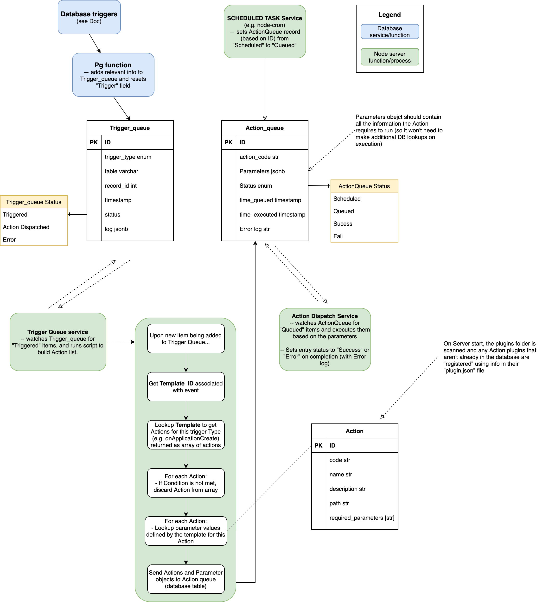

# Triggers & Actions

<!-- toc -->

## Article Contents

- [Overview of Trigger and Action system](#overview-of-trigger-and-action-system)
- [List of available Triggers and the "listener" associated with it.](#list-of-available-triggers-and-the-listener-associated-with-it)
- [Actions](#actions)
- [Action parameters](#action-parameters)
- [Passing information to Actions](#passing-information-to-actions)

<!-- tocstop -->

In order to facilitate customisable events in Application Templates, there is a system of **Triggers** associated with various events that, in turn, trigger **Actions** -- "things that happen" in response to a trigger.

An Application Template will specify:

- Set of Triggers
- Action(s) that happen in response to each trigger
- Conditions (using [dynamic expression syntax](Query-Syntax.md)) under which the Action will run
- And parameters (again, as dynamic expressions) that will be sent to the Action at runtime

Most triggers are associated with events on the main database tables (Application, Review, etc.). Specifically, there is a field on these tables called `trigger` into which the "event" (e.g. "On Application Submit") is recorded. The database listens to this field, then notifies the server, which launches the appropriate Actions, using parameters from the current conditions.

Actions can be defined as **Sequential** or **Async** (parallel). Async Actions are executed as soon as the server is notified that they are in the Action queue, whereas Sequential Actions have an additional `sequence` property, and are processed in the prescribed sequence once they've all been inserted into the Action queue.

Actions also return an **output** object (e.g. `createUser` Action returns user details). For sequential Actions, the output properties are collected into a `cumulativeOutput` object which is passed to the parameter evaluator (along with the **application_data\*** field), so subsequent Actions can access any of the output properties of any previous Action in the sequence.

\* The `application_data` field in the **application_queue** contains basic information about the triggering event and the application associated with it (more below).

## Overview of Trigger and Action system



## List of available Triggers and the "listener" associated with it.

| Trigger Name             | Listener                                                         |
| ------------------------ | ---------------------------------------------------------------- |
| `onApplicationCreate`    | Postgres trigger on `Application` table                          |
| `onApplicationSubmit`    | Postgres trigger on `Application` table                          |
| `onApplicationSave`      | Postgres trigger on `Application` table                          |
| `onApplicationWithdrawn` | Postgres trigger on `Application` table                          |
| `onReviewCreate`         | Postgres trigger on `Review` table                               |
| `onReviewSubmit`         | Postgres trigger on `Review` table                               |
| `onEditComment`          | Postgres trigger on `Review_response` table                      |
| `onApplicationAssign`    | Postgres trigger on `Review_section_assign` table                |
| `onApprovalSubmit`       | Postgres trigger on `Review_section` table                       |
| `onActionComplete`       | Postgres trigger on `Action_queue` table                         |
| `onScheduledTime`        | Server scheduled service (see [here](link to Scheduled actions)) |

## Actions

Actions are implemented as **plug-ins** -- standalone packages that can be created and customised outisde the main application. As far as the Server is concerned, an Action plug-in is basically an imported **function**, with a defined set of expected parameters.

Here is a list of Actions which are anticipated to be part of the core system: (work in progress):

| Action Name              | Required Parameters                                                                                                                                                                                                                                                                      |
| ------------------------ | ---------------------------------------------------------------------------------------------------------------------------------------------------------------------------------------------------------------------------------------------------------------------------------------- |
| `sendNotification`       | <ul> <li>user/org (string)</li> <li>Recipient (user/org id)</li> <li>Subject (string)</li> <li>Message (int/string) (reference to predefined messages)</li> <li>Attachments (file paths)</li> </ul>                                                                                      |
| `changeStatus`           | <ul> <li>Application_id</li> <li>New status (string)</li> </ul>                                                                                                                                                                                                                          |
| `changeStage`            | <ul> <li>Application_id</li> <li>Change amount (int) (usually +1)</li> </ul>                                                                                                                                                                                                             |
| `setPriority`            | <ul> <li>Application_id</li> <li>Priority (int)</li> </ul>                                                                                                                                                                                                                               |
| `setPermission`          | <ul> <li>Permission_name_id</li> <li>user/org (string)</li> <li>user/org_id</li> <li>template_id</li> <li>??</li> <li>Action (add/revoke)</li> </ul>                                                                                                                                     |
| `modifyEntity`           | <ul> <li>ActionType (create/edit/delete)</li> <li>Database Table (string)</li> <li>Properties (JSON object with attribute:value pairs)</li> </ul>                                                                                                                                        |
| `duplicate`              | NOT SURE                                                                                                                                                                                                                                                                                 |
| `createScheduledTrigger` | <ul> <li>Timestamp (time of execution)</li> <li>Action(s) (to execute) (array of Action objects)</li> </ul>                                                                                                                                                                              |
| ~~`checkCondition`~~     | ~~<ul> <li>Condition (expression)</li> <li>Action results (object mapping results of Condition<br/> to actions (with parameters)) E.g.</li> </ul> <pre><code class="code-highlighted code-sql">{ True: SetPermission(parameters),<br/> False: SetPermission(parameters) }</code></pre>~~ |
| `multipleAction`         | <ul> <li>Array of action objects (to execute in sequence)</li> </ul>                                                                                                                                                                                                                     |

## Action parameters

Actions associated with templates (in **action_template** table) have two fields that can store [dynamic expressions](Query-Syntax.md) which are evaluated at runtime. These are:

- **condition**: an expression which must evaluate to a boolean. If `true` at runtime, the Action will run. An example usage could be to check the current status of the application and only run if it matches a certain value.
- **parameter_queries**: Every Action plugin has prescribed required parameters (see [Action plugin specification](Action-plugin-specification.md)). In the parameter_queries field, every required parameter has an expression associated which is used to generate the parameter value at runtime. See the [list of Action plugins](List-of-Action-plugins.md) for each plugin's required parameters

## Passing information to Actions

The expressions which are defined in the above fields will often need access to information about the current application state or current user details (for example). While this information can always be extracted from the database (using the `pgSQL` or `graphQL` operators), it will normally be faster and simpler to pass this information in directly.

There are two local state objects passed into the expression evaluator (which can be accessed using the `objectProperties` operator) when processing Triggers/Actions:

- **applicationData**: A collection of useful application state information that is fetched during trigger processing. The (current) fields provided are:

  - `trigger_id`: ID of the trigger record in the `trigger_queue` table
  - `trigger`: name of the trigger e.g. `onApplicationSubmit`
  - `table`: the table that was triggered e.g. `application`, `review`
  - `record_id`: the id of the record on the above table that was triggered
  - `applicationId`
  - `templateId`
  - `stageId` (from `template_stage`)
  - `stageNumber`
  - `stage` (name of current stage)
  - `stageHistoryId`
  - `stageHistoryTimeCreated`
  - `statusHistoryId`
  - `status`: (name of current status)
  - `statusHistoryTimeCreated`
  - `userId`
  - `firstName`
  - `lastName`
  - `username`
  - `dateOfBirth`
  - `email`
  - `responses` : `{ [questionCode] : value }` (current application responses by code)

    _Note: more info, such as org data and review state will probably be added to this object._  
     ~~Because this data is only generated once per trigger, it will not be updated between sequential Actions. i.e if the application status is "Draft", then that value will be still be exposed to subsequent Actions in a sequence even if the first one changes the status to "Submitted" (In which case the `cumulativeOutput` object would be useful).~~ **TO BE UPDATED SOON** - will re-fetch between Actions.

- **cumulativeOutput**: When sequential Actions run, the output from each one is collected into this combined object and passed to subsequent Actions in the sequence. So the final Action in a sequence will have access to the output properties from _all_ previous Actions. Note, however, this object is **not** available to the **condition** evaluator, since all Action conditions are evaluated before the Action sequence is run.

These two objects are passed to the evalutor in this order, so when using the `objectProperties` operator to access them, `applicationData` will have index `0`, and `cumulativeOutput` will have index `1`.

**Examples:**

1. If you want a certain Action to only run when the current application status is "Draft", the `condition` expression would be:

```
{
  operator: "=",
  children: [
    {
      operator: "objectProperties",
      children: [{ value: { property: "status"}}]
    },
    { value: "Draft" }
  ]
}
```

_Note that the `objectIndex: 0` parameter is not required for `objectProperties` as `0` is the default._

2. For the "Change Status" plugin, the required parameters are `applicationId` and `newStatus`. To change the triggered application to status "Submitted", the `parameter_queries` expression would be:

```
{
  applicationId: {
    operator: "objectProperties",
    children: [{ value: { property: "applicationId" }}] },
  newStatus: { value: "Submitted" }
}
```

3. A sequential "Console Logger" Action, which follows after "Create User" and "Change Outcome", needs to print a message about newly-created User to the console. It's `parameter_queries` expression could be:

```
{
    message: {
      operator: "CONCAT"
      children: [
        { value: "Output concatenation: The user " },
        {
          operator: "objectProperties",
          children: [ { value: { objectIndex: 1, property: "username" } } ]
        },
        { value: "'s registration has been " },
        {
          operator: "objectProperties",
          children: [ { value: { objectIndex: 1, property: "newOutcome" } } ]
        }
      ]
    }
}
```
